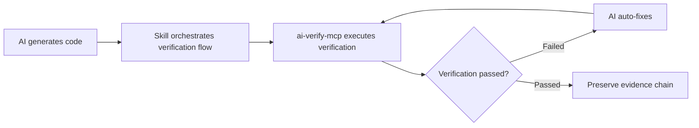

# ValidPilot Verify

> **Don't just generate, verify.**
>
> Make AI code generation verifiable and trustworthy. Evidence-driven MCP verification platform.

[](https://www.npmjs.com/package/ai-verify-mcp)
[](https://www.npmjs.com/package/ai-verify-mcp)
[](https://github.com/validpilot/ai-verify-mcp/actions/workflows/ci.yml)
[](LICENSE)
[]()
[]()
[](CODE_OF_CONDUCT.md)
[](README.md)

> 📘 **New to MCP?** Start with [MCP Protocol Cheatsheet](docs/MCP-CHEATSHEET.md) — understand MCP in 5 minutes.
> 📖 **Detailed user guide?** See [User Manual](docs/USER-MANUAL.md) — from installation to mastery.
> 🔧 **Having issues?** See [Log Troubleshooting Guide](docs/LOG-TROUBLESHOOTING.md) — common errors and solutions.

---

## 📑 Table of Contents

- [🎯 One-Sentence Introduction](#-one-sentence-introduction)
- [🔄 Skill + MCP = Best Experience](#-skill--mcp--best-experience)
- [⚡ Quick Start](#-quick-start)
- [🔧 Configure MCP Server](#-configure-mcp-server)
- [🎬 Practical Usage Examples](#-practical-usage-examples)
- [🏆 Why Choose ValidPilot Verify?](#-why-choose-validpilot-verify)
- [📦 Complete Tool List](#-complete-tool-list)
- [🔬 Evidence Chain Concept](#-evidence-chain-concept)
- [⚙️ Environment Variables](#️-environment-variables)
- [❓ FAQ](#-faq)
- [🔌 MCP Client Configuration Quick Reference](#-mcp-client-configuration-quick-reference)
- [🎬 Demo: ✅ vs ❌ Comparison](#-demo-vs--comparison)
- [📦 Release Automation](#-release-automation)
- [🙏 Acknowledgments](#-acknowledgments)
- [💬 Community & Contact](#-community--contact)
- [❤️ Support the Project](#️-support-the-project)

---

## 🎯 One-Sentence Introduction

**ValidPilot Verify** is a verification platform for AI programming. Through the MCP protocol, AI can automatically verify code generation results — **generating screenshot evidence, diagnosing error root causes, and preserving a complete evidence chain**.

> **💡 Best Practice**: Use with the **Skill system** of AI IDEs (like Trae) to form a complete inner loop of "generate → verify → fix → re-verify". Skill coordinates the verification process, and ai-verify-mcp provides 77 underlying verification tools. The combination is far more effective than using either alone.

### What can it do?

- 🔍 **Verify AI-generated code** — open pages, click buttons, fill forms, validate results
- 📸 **Preserve evidence chain** — automatic screenshots at each step, forming a traceable evidence chain
- 🐛 **Intelligent error diagnosis** — automatic root cause analysis with confidence scores and fix suggestions
- ✅ **Assertion verification** — verify element existence, text content, URL matching, etc.
- 📊 **Generate verification reports** — Markdown reports with screenshot evidence and diagnosis results

---

## 🔄 Skill + MCP = Best Experience

ai-verify-mcp provides 77 **underlying verification tools** (browser operations, screenshots, a11y scanning, assertion verification, etc.), but these tools need to be **orchestrated** to complete a full verification task.

The **Skill system** (like Trae's `browser-dev-full-validation-skill`) is precisely this orchestration layer — it defines a standard verification process:



### Skill is Responsible For

| Responsibility | Description |
|------|------|
| **Process Orchestration** | Define verification step order: open page → screenshot → check a11y → assert results |
| **Evidence Management** | Unified storage of screenshots, logs, HAR files in each phase's artifact directory |
| **Generate Verification Reports** | Summarize multi-round verification results into a complete report (success rate, fault list, fix suggestions) |
| **Baseline Comparison** | Compare current verification results with previous round (or original version) to calculate regression |

### ai-verify-mcp is Responsible For

| Responsibility | Description |
|------|------|
| **77 Atomic Verification Tools** | `browser_open` / `browser_screenshot` / `browser_a11y_check` / `browser_assert` / `console_error_check` / `network_check`, etc. |
| **Evidence Chain Collection** | Automatic screenshots at each step, recording Console logs and network requests |
| **Contrast/CSS Variable Scanning** | axe-core integration, CSS variable tracking |
| **Report Output** | Structured JSON + Markdown reports |

> 💡 **Best Practice**: Enable both `browser-dev-full-validation-skill` + `ai-verify-mcp` MCP Server in Trae. Skill automatically orchestrates the 7-phase verification process, and ai-verify-mcp provides the underlying execution capability. **Both are essential** — MCP alone lacks orchestration, Skill alone lacks execution capability.

---

## ⚡ Quick Start

### Method 1: 5-Minute Quick Experience

```bash
# 1. Install
npm install ai-verify-mcp

# 2. Start the service
npx ai-verify-mcp start

# 3. Configure MCP in your AI assistant (using Cursor as example)
```

### Method 2: Direct Verification (No MCP Required)

```bash
# Quickly verify a webpage
npx ai-verify-mcp validate --url https://example.com

# Take screenshot for evidence
npx ai-verify-mcp screenshot --url https://example.com --name evidence-001

# One-click check
npx ai-verify-mcp quick-check --url https://example.com
```

---

## 🔧 Configure MCP Server

### Using with Cursor

1. Open Cursor → Settings → MCP Servers → Add
2. Fill in the configuration:

Add to the IDE's MCP configuration file (project-level `.cursor/mcp.json` or user-level configuration):

```json
{
  "ai-verify-mcp": {
    "command": "npx",
    "args": ["-y", "ai-verify-mcp"],
    "env": {
      "MCP_MODE": "http",
      "MCP_HTTP_PORT": "3456"
    }
  }
}
```

### Using with Claude Code

Create `.mcp.json` in the project root directory:

```json
{
  "mcpServers": {
    "ai-verify-mcp": {
      "command": "npx",
      "args": ["-y", "ai-verify-mcp"],
      "env": {
        "MCP_MODE": "http",
        "MCP_HTTP_PORT": "3456"
      }
    }
  }
}
```

### Using with Windsurf

Settings → MCP Servers → Add:

```json
{
  "ai-verify-mcp": {
    "command": "npx",
    "args": ["-y", "ai-verify-mcp"]
  }
}
```

---

## 🎬 Practical Usage Examples

### Scenario: Verify an AI-Generated Login Page

**You tell AI:**
> "Help me verify this login page: open https://example.com/login, enter username test and password 123, click the login button, and verify if it redirects to the homepage."

**Tool chain called by AI:**

```
1. browser_open → Open login page (screenshot: login-page.png)
2. browser_type → Enter username (screenshot: username-filled.png)
3. browser_type → Enter password (screenshot: password-filled.png)
4. browser_click → Click login button (screenshot: login-clicked.png)
5. validation_check → Verify redirect to homepage (screenshot: homepage.png)
6. browser_assert → Assert URL contains /home (generate evidence report)
```

**Result: Complete evidence chain**

```
artifacts/
├── login-page.png          # Initial page state
├── username-filled.png     # After entering username
├── password-filled.png     # After entering password
├── login-clicked.png       # After clicking login
├── homepage.png            # After successful login
└── validation-report.md    # Verification report (with diagnosis results)
```

---

## 🏆 Why Choose ValidPilot Verify?

| Feature | ValidPilot Verify | Playwright | Puppeteer |
|------|-------------------|------------|-----------|
| **Native MCP Protocol** | ✅ Out of the box | ❌ Requires custom wrapping | ❌ Requires custom wrapping |
| **AI Agent Friendly** | ✅ 77 dedicated tools | ❌ General-purpose API | ❌ General-purpose API |
| **Evidence Chain Preservation** | ✅ Auto screenshots + timestamps | ❌ Manual implementation | ❌ Manual implementation |
| **Intelligent Diagnosis** | ✅ Root cause + confidence | ❌ Logs only | ❌ Logs only |
| **Verification Reports** | ✅ Markdown + screenshots | ❌ Requires custom coding | ❌ Requires custom coding |
| **Quick Verification** | ✅ One-click 7-item check | ❌ Requires writing tests | ❌ Requires writing tests |

**Core difference**: Playwright/Puppeteer are the "hands" (responsible for operations), ValidPilot Verify is the "eyes + brain" (responsible for checking and verification).

### Skill + MCP Synergy Advantages

| MCP Alone | Skill Alone | **Skill + MCP Combination** |
|-----------|------------|-------------------|
| 77 tools but requires manual orchestration | Has process but lacks execution capability | ✅ Auto-orchestration + auto-execution |
| Scattered verification results | Fixed process templates | ✅ Complete evidence chain + flexible configuration |
| Requires manual diff comparison | Cannot directly control browser | ✅ Fully automated closed loop |

> ✅ **Recommended Configuration**: Enable `browser-dev-full-validation-skill` in Trae, and configure `ai-verify-mcp` as an MCP Server. Skill is responsible for "when to verify, what to verify", and MCP is responsible for "how to verify".

---

## 📦 Complete Tool List

### ✅ Verification Framework (14 tools)

| Tool | Description |
|------|------|
| `validation_check` | Checkpoint verification (load time, JS errors, HTTP errors, etc.) |
| `validation_element` | Element state verification (existence, visibility, text contains, etc.) |
| `validation_flow` | Flow verification (multi-step verification process) |
| `validation_quick_run` | One-click quick verification (7 checks) |
| `validation_report` | Generate verification report |
| `validation_report_export` | Export verification report |
| `browser_assert` | Assertion verification (URL, title, elements, etc.) |
| `screenshot_diff` | Visual regression comparison |

### 🔍 Intelligent Diagnosis (12 tools)

| Tool | Description |
|------|------|
| `browser_diagnose` | Automatic error diagnosis (root cause analysis + confidence) |
| `browser_element_status` | Element status check (visibility, interactivity, occlusion) |
| `browser_quick_fix` | Quick fix (8 strategies auto-tried) |
| `browser_verify_fix` | Fix verification closed loop |
| `browser_debug_report` | Debug report generation |
| `browser_errors_aggregate` | Error aggregation statistics |
| `error_fix_suggestion` | Fix suggestions (rule-based) |
| `error_summary_md` | Error summary (Markdown) |
| `debug_investigate` | Deep investigation |

### 📸 Evidence Collection (6 tools)

| Tool | Description |
|------|------|
| `browser_screenshot` | Full-page screenshot |
| `browser_screenshot_element` | Element screenshot |
| `browser_artifacts` | Artifact management |
| `browser_artifacts_clear` | Clear artifacts |
| `browser_har_export` | Export HAR file |
| `browser_snapshot` | Page snapshot |

### 🌐 Browser Operations (21 tools)

Full browser operation capabilities: open, click, type, scroll, wait, cookies, storage, network, console, etc.

### 🎯 Intelligent Locator (4 tools)

| Tool | Description |
|------|------|
| `browser_find_element` | Intelligent element finding by text |
| `browser_locator_suggest` | Selector suggestions |
| `browser_locator_validate` | Selector validation |
| `browser_find_page` | Page type recognition |

---

## 🔬 Evidence Chain Concept

**Evidence chain** is the core concept of ValidPilot Verify:

1. **Automatic screenshots at each step** — timestamp + operation type + result status
2. **Automatic error diagnosis** — error type + root cause analysis + confidence score
3. **Fix suggestion generation** — rule-based fix suggestions + verification closed loop
4. **Automatic report generation** — Markdown report + screenshot references + diagnosis results

**Example evidence chain report:**

```markdown
# Verification Report - Login Flow

## ✅ Passed Steps

| Step | Action | Screenshot | Timestamp |
|------|------|------|--------|
| 1 | Open login page | login-page.png | 2026-06-28T10:00:00Z |
| 2 | Enter username | username-filled.png | 2026-06-28T10:00:05Z |
| 3 | Click login | login-clicked.png | 2026-06-28T10:00:10Z |

## ❌ Failed Steps

| Step | Action | Error | Screenshot | Diagnosis |
|------|------|------|------|------|
| 4 | Verify homepage | URL mismatch | homepage.png | Confidence: 85% - Login may have failed |

**Error type**: Verification failed
**Confidence**: 85%
**Suggestion**: Check if login was successful, look for error messages
```

---

## ⚙️ Environment Variables

| Variable | Description | Default |
|------|------|--------|
| `MCP_MODE` | MCP operation mode (stdio/http) | stdio |
| `MCP_HTTP_PORT` | HTTP port | 3456 |
| `VALIDPILOT_ARTIFACTS_DIR` | Evidence storage directory | ./artifacts |
| `SCREENSHOT_QUALITY` | Screenshot quality | 80 |

---

## ❓ FAQ

### Q: What's the difference from browser-mcp?

**browser-mcp** is the "hand" — responsible for operating the browser (open, click, type).
**ai-verify-mcp** is the "eyes + brain" — responsible for verification and diagnosis (check results, preserve evidence, diagnose errors).

The two can be used together: browser-mcp operates, ai-verify-mcp verifies.

### Q: Which AI assistants are supported?

All MCP protocol-compatible AI assistants are supported: Cursor, Claude Code, Windsurf, Cline, etc.

### Q: Where is evidence stored?

By default in the `./artifacts` directory, including screenshots, HAR files, verification reports, etc.

### Q: Startup failure — `Error: Playwright browser failed to launch`

- **Cause A**: Playwright browser binary not installed
- **Solution**: Run `npx playwright install chromium`
- **Cause B**: Linux system missing system libraries
- **Solution**: Debian/Ubuntu — `apt-get install libnspr4 libnss3 libatk1.0-0 libdrm2 libxkbcommon0 libxcomposite1 libxdamage1 libxfixes3 libxrandr2 libgbm1 libasound2`

### Q: MCP connection failure — `MCP error -32000: Connection closed`

- **Cause**: `node` executable path not found in MCP Host
- **Solution**: Use `command: "npx" args: ["-y", "ai-verify-mcp"]` in MCP config instead of `node .../start-http.js`

### Q: Port 3456 is already in use

- **Solution**: Specify a custom port in MCP config: `"env": { "MCP_HTTP_PORT": "3557" }`

### Q: Screenshots not generated to ./artifacts

- **Check 1**: Process has write permission to the current directory
- **Check 2**: Override via environment variable: `"env": { "VALIDPILOT_ARTIFACTS_DIR": "C:/temp/evidence" }`
- **Check 3**: Whether AI actually called `browser_screenshot` tool (check ListTools call logs in MCP debug mode)

---

## 🔌 MCP Client Configuration Quick Reference

> All clients have consistent stdio/HTTP shape, below are **copy-paste-ready** configuration blocks.

### ✅ Cursor (project-level recommended)

`.cursor/mcp.json` (project root directory):

```json
{
  "mcpServers": {
    "ai-verify-mcp": {
      "command": "npx",
      "args": ["-y", "ai-verify-mcp"],
      "env": {
        "MCP_HTTP_PORT": "3456"
      }
    }
  }
}
```

### ✅ Claude Desktop

Edit `%APPDATA%/Claude/claude_desktop_config.json` (Windows) or `~/Library/Application Support/Claude/claude_desktop_config.json` (macOS):

```json
{
  "mcpServers": {
    "ai-verify-mcp": {
      "command": "npx",
      "args": ["-y", "ai-verify-mcp"],
      "env": {
        "MCP_HTTP_PORT": "3456"
      }
    }
  }
}
```

> ⚠️ Claude Desktop only loads user-level config files, restart Claude Desktop to see new tools.

### ✅ Windsurf

`~/.codeium/windsurf/mcp_config.json`:

```json
{
  "mcpServers": {
    "ai-verify-mcp": {
      "command": "npx",
      "args": ["-y", "ai-verify-mcp"],
      "env": {
        "MCP_HTTP_PORT": "3456"
      }
    }
  }
}
```

### ✅ Claude Code (local installation)

`.mcp.json` in project root directory:

```json
{
  "mcpServers": {
    "ai-verify-mcp": {
      "command": "npx",
      "args": ["-y", "ai-verify-mcp"]
    }
  }
}
```

### ✅ Cline / Continue / Other stdio MCP Clients

```json
{
  "name": "ai-verify-mcp",
  "command": "npx",
  "args": ["-y", "ai-verify-mcp"]
}
```

### ✅ Trae IDE

**Choose one of two entry points, project-level recommended:**

#### Method A — Project-level (recommended, shared by team)

Create `.trae/mcp.json` in the project root directory:

```json
{
  "mcpServers": {
    "ai-verify-mcp": {
      "command": "npx",
      "args": ["-y", "ai-verify-mcp"],
      "env": {
        "MCP_HTTP_PORT": "3456"
      }
    }
  }
}
```

#### Method B — User-level (global effect)

`%APPDATA%\Trae\User\mcp.json` (Windows) or `~/.config/Trae/User/mcp.json` (macOS/Linux):

```json
{
  "mcpServers": {
    "ai-verify-mcp": {
      "command": "npx",
      "args": ["-y", "ai-verify-mcp"],
      "env": {
        "MCP_HTTP_PORT": "3456"
      }
    }
  }
}
```

> 💡 Trae's settings → MCP → "+ Add" → "Raw Config (JSON)" button can directly pop up the corresponding path; restart the Trae session after saving to load new tools.

#### ⚠️ Trae MCP Limit Notice

Due to limited model context window, Trae introduces **two hard limits** for MCP:

| Limit Item | Upper Limit | Consequence |
|--------|--------|---------|
| Total characters of **all MCP Server tool descriptions** | ≤ 8000 characters | Excess will be **discarded at tool granularity** |
| **Total number of tools** across all MCP Servers | ≤ 40 tools | Excess will be **discarded at tool granularity** |

> 📌 Source: [Trae Official FAQ｜MCP Tools · 2026-02](https://forum.trae.cn/t/topic/65)

After stacking many MCPs, you may experience "`list tools failed`" or incomplete tool display — this is not an issue with ai-verify-mcp itself, but rather tool descriptions being dropped at tool granularity after reaching Trae's limits. Please refer to Trae's official documentation for specific mitigation measures.

### ✅ Codex CLI (OpenAI)

`~/.codex/config.toml` (**TOML format**, note the difference from JSON):

```toml
[mcp_servers.ai-verify-mcp]
command = "npx"
args = ["-y", "ai-verify-mcp"]

[mcp_servers.ai-verify-mcp.env]
MCP_HTTP_PORT = "3456"
```

Or add via CLI one-time:

```bash
codex mcp add ai-verify-mcp -- npx -y ai-verify-mcp
```

> 💡 Codex CLI defaults to stdio, HTTP port is only used when `MCP_MODE=http`; if you need HTTP for browser debugging, start `start-http.js` and let Codex connect via SSE/HTTP (Codex 0.40+ supported).

### ✅ OpenClaw (open-source Claude Code alternative)

`~/.openclaw/openclaw.json`:

```json
{
  "mcp": {
    "servers": {
      "ai-verify-mcp": {
        "command": "npx",
        "args": ["-y", "ai-verify-mcp"],
        "env": {
          "MCP_HTTP_PORT": "3456"
        }
      }
    }
  }
}
```

> 💡 OpenClaw uses `mcp.servers.<name>` nested structure (without the servers suffix is another style), same protocol origin as Claude Code, can be smoothly migrated.

### ✅ Hermes Agent (Nous Research)

`~/.hermes/config.yaml` (YAML format, different path from JSON):

```yaml
mcp_servers:
  ai-verify-mcp:
    command: "npx"
    args: ["-y", "ai-verify-mcp"]
    env:
      MCP_HTTP_PORT: "3456"
```

Or add via CLI interactively:

```bash
hermes mcp add ai-verify-mcp \
  --command "npx" \
  --args "-y,ai-verify-mcp"
```

> 💡 Hermes will auto-discover the tool list, after startup use `hermes tools list` to see `browser_*`, `validation_*` etc. tools already registered.

### ✅ Huawei Cloud CodeArts (MaDao IDE)

Settings → MCP Tools → "Configure MCP" → Edit `mcp_settings.json`:

```json
{
  "mcpServers": {
    "ai-verify-mcp": {
      "command": "npx",
      "args": ["-y", "ai-verify-mcp"],
      "env": {
        "MCP_HTTP_PORT": "3456"
      }
    }
  }
}
```

Or execute in IDE command palette:

1. `Ctrl+Shift+P` → "CodeArts: Add MCP Server"
2. Select stdio → fill in `npx` and `-y,ai-verify-mcp`
3. Configuration automatically written to `mcp_settings.json`

> ⚠️ Huawei Cloud MaDao **recommends enabling ≤ 8 MCPs, 3 is optimal**, this tool is verification-type, recommended to share with Playwright, Context7, etc. and set defer_loading to avoid conflicts.

### ✅ Tencent CodeBuddy

**Method A — Recommended: `~/.codebuddy/.mcp.json` (recommended)**

`~/.codebuddy/.mcp.json` (global) or project root `.mcp.json` (project-level):

```json
{
  "mcpServers": {
    "ai-verify-mcp": {
      "command": "npx",
      "args": ["-y", "ai-verify-mcp"],
      "env": {
        "MCP_HTTP_PORT": "3456"
      }
    }
  }
}
```

**Method B — Settings.json integration**

Settings → "Add MCP" → automatically opens `settings.json`, append:

```json
{
  "mcpServers": {
    "ai-verify-mcp": {
      "command": "npx",
      "args": ["-y", "ai-verify-mcp"]
    }
  }
}
```

> 💡 CodeBuddy supports STDIO / SSE / HTTP three transports, configurations in this section are all STDIO (most common); if you need HTTP mode, replace `command/args` with `url: "http://localhost:3456/sse"`.

---

## 🎬 Demo: ✅ vs ❌ Comparison

### ❌ Without Verification (Regular AI Programming)

```
👤 "Write me a login page"
🤖 "Generated login.html / login.js ... ✅"
👤 "Does it work?"
🤖 "Should be fine"
👤 "......"   ← No evidence
```

### ✅ With ValidPilot Verify

```
👤 "Write me a login page, and verify it after you're done"
🤖 "Sure, I'll verify as I write:
    1. Open page → validation_quick_run ✅
    2. Enter username → screenshot saved
    3. Enter password → screenshot saved
    4. Click login → screenshot + URL assertion ✅
    5. Verify homepage → evidence/report.md ✅"
👤 *(Click evidence/login-flow-report.md to view screenshot evidence chain)*
```

Complete evidence chain file structure:

```
artifacts/
├── step-1-login-page.png
├── step-2-username-typed.png
├── step-3-password-typed.png
├── step-4-login-clicked.png
├── step-5-home-verified.png
└── login-flow-report.md
```

---

## 📦 Release Automation

Health checks are automatically executed when publishing to npm:

```json
{
  "scripts": {
    "start": "node server.js",
    "http": "node start-http.js",
    "cli": "node bin/validpilot.js",
    "validate": "node bin/validpilot.js health",
    "pack:dry": "npm pack --dry-run",
    "prepublishOnly": "node bin/validpilot.js health && npm pack --dry-run"
  }
}
```

Execution flow:
```bash
$ npm publish
> ai-verify-mcp@1.0.0 prepublishOnly
> node bin/validpilot.js health && npm pack --dry-run

{ "ok": true, "name": "ai-verify-mcp", "version": "1.0.0", ... }
npm notice package size: 102.4 kB
npm notice total files: 101
+ npm publish → upload to npm registry
```

Manual verification before publishing:
- `npm run validate` — Playwright health check
- `npm run pack:dry` — Package preview (without actual packaging)

---

## 🙏 Acknowledgments

Thanks to the following projects and technologies for inspiration:
- [Playwright](https://playwright.dev/) — Browser automation engine
- [@modelcontextprotocol/sdk](https://github.com/modelcontextprotocol/typescript-sdk) — MCP protocol SDK
- [axe-core](https://github.com/dequelabs/axe-core) — Accessibility checking

---

## 💬 Community & Contact

### DingTalk Group

Scan the QR code to join the official `ai-verify-mcp` DingTalk group for questions, feedback, and best practices:


> This QR code is permanently valid

### Contact Email

📧 [validpilot@outlook.com](mailto:validpilot@outlook.com)

- Business cooperation
- Security vulnerability reports (please use the [SECURITY.md](SECURITY.md) process first)
- Other inquiries

---

## ❤️ Support the Project

Thank you for your interest in this project!

If you find this project helpful or would like to support my ongoing development and maintenance, you're welcome to make a donation. Every contribution, no matter how small, is a great encouragement to me and helps keep this project alive and growing.

Donations will be used for project maintenance, feature development, server costs, and other related expenses. All funds will be used transparently and responsibly.

### Donation Options

| Alipay | WeChat Pay |
|:---:|:---:|
|  |  |

> Thank you again for your support — it means a lot!

> **PayPal / GitHub Sponsors**: Coming soon.

---

**Contributing** — Contributions welcome! Read [CONTRIBUTING.md](CONTRIBUTING.md) to learn how to participate. Please follow the [Code of Conduct](CODE_OF_CONDUCT.md).

**Security** — Found a vulnerability? See [SECURITY.md](SECURITY.md) for security policy.

**AI Agents** — Are you an AI Agent? See [AGENTS.md](AGENTS.md) for coding guidelines and project conventions.

**License** — [MIT](LICENSE) © 2026 ValidPilot

## 📜 License

[MIT](LICENSE) © 2026 ValidPilot Team

---

> **Don't just generate, verify.** — Make AI programming trustworthy.