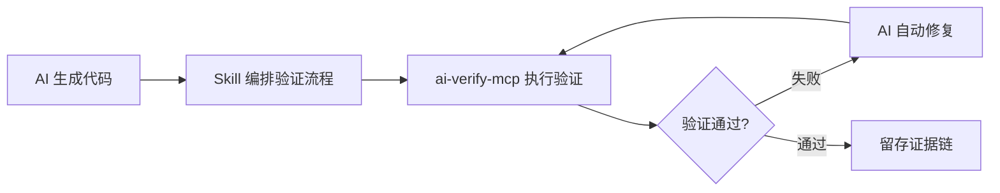

# ValidPilot Verify

> **Don't just generate, verify.**
>
> 让 AI 代码生成结果可验证、可信赖。证据驱动的 MCP 验证平台。

[](https://www.npmjs.com/package/ai-verify-mcp)
[](https://www.npmjs.com/package/ai-verify-mcp)
[](LICENSE)

> 📘 **MCP 新手？** 先看 [MCP 协议速查手册](docs/MCP-CHEATSHEET.md) — 5 分钟搞懂 MCP。
> 📖 **详细操作指南？** 看 [用户操作手册](docs/USER-MANUAL.md) — 从安装到精通。
> 🔧 **遇到问题？** 看 [日志排查手册](docs/LOG-TROUBLESHOOTING.md) — 常见错误与解决方案。

---

## 📑 目录

- [🎯 一句话介绍](#-一句话介绍)
- [🔄 Skill + MCP = 最佳体验](#-skill--mcp--最佳体验)
- [⚡ 快速开始](#-快速开始)
- [🔧 配置 MCP Server](#-配置-mcp-server)
- [🎬 实际使用示例](#-实际使用示例)
- [🏆 为什么选择 ValidPilot Verify？](#-为什么选择-validpilot-verify)
- [📦 完整工具列表](#-完整工具列表)
- [🔬 证据链概念](#-证据链概念)
- [⚙️ 环境变量](#️-环境变量)
- [❓ 常见问题](#-常见问题)
- [🔌 MCP Client 配置速查](#-mcp-client-配置速查)
- [🎬 演示：✅ vs ❌ 对比](#-演示-vs--对比)
- [📦 发布自动化](#-发布自动化)
- [🙏 致谢](#-致谢)

---

## 🎯 一句话介绍

**ValidPilot Verify** 是一个面向 AI 编程的验证平台。通过 MCP 协议，AI 可以自动验证代码生成结果——**生成截图证据、诊断错误根因、留存完整证据链**。

> **💡 最佳使用方式**：配合 AI IDE（如 Trae）的 **Skill 系统** 使用，形成「生成 → 验证 → 修复 → 复验」的完整内循环。Skill 负责协调验证流程，ai-verify-mcp 提供 77 个底层验证工具，两者组合效果远优于单独使用。

### 它能做什么？

- 🔍 **验证 AI 生成的代码** — 打开页面、点击按钮、填写表单、验证结果
- 📸 **留存证据链** — 每步操作自动截图，形成可追溯的证据链
- 🐛 **智能诊断错误** — 自动分析错误根因，给出置信度评分和修复建议
- ✅ **断言验证** — 验证元素存在、文本内容、URL 匹配等
- 📊 **生成验证报告** — Markdown 报告，包含截图证据和诊断结果

---

## 🔄 Skill + MCP = 最佳体验

ai-verify-mcp 提供 77 个**底层验证工具**（浏览器操作、截图、a11y 扫描、断言验证等），但这些工具需要被**编排调用**才能完成完整的验证任务。

**Skill 系统**（如 Trae 的 `browser-dev-full-validation-skill`）正是这个编排层——它定义了一套标准验证流程：



### Skill 负责

| 职责 | 说明 |
|------|------|
| **流程编排** | 定义验证步骤顺序：打开页面 → 截图 → 检查 a11y → 断言结果 |
| **证据管理** | 统一存放截图、日志、HAR 文件到各阶段产物目录 |
| **生成验证报告** | 将多轮验证结果汇总为一份完整报告（成功率、故障清单、修复建议） |
| **对比基准** | 对比当前验证结果与上一轮（或原始版本），计算回归情况 |

### ai-verify-mcp 负责

| 职责 | 说明 |
|------|------|
| **77 个原子验证工具** | `browser_open` / `browser_screenshot` / `browser_a11y_check` / `browser_assert` / `console_error_check` / `network_check` 等 |
| **证据链采集** | 每步操作自动截图，记录 Console 日志和网络请求 |
| **对比度/CSS 变量扫描** | axe-core 集成、CSS 变量追踪 |
| **报告输出** | 结构化 JSON + Markdown 报告 |

> 💡 **最佳实践**：在 Trae 中同时启用 `browser-dev-full-validation-skill` + `ai-verify-mcp` MCP Server。Skill 自动编排 7 阶段验证流程，ai-verify-mcp 提供底层执行能力。**两者缺一不可**——只有 MCP 缺乏编排，只有 Skill 缺乏执行能力。

---

## ⚡ 快速开始

### 方式一：5 分钟快速体验

```bash
# 1. 安装
npm install ai-verify-mcp

# 2. 启动服务
npx ai-verify-mcp start

# 3. 在 AI 助手中配置 MCP（以 Cursor 为例）
```

### 方式二：直接验证（无需 MCP）

```bash
# 快速验证一个网页
npx ai-verify-mcp validate --url https://example.com

# 截图留证
npx ai-verify-mcp screenshot --url https://example.com --name evidence-001

# 一键检查
npx ai-verify-mcp quick-check --url https://example.com
```

---

## 🔧 配置 MCP Server

### 在 Cursor 中使用

1. 打开 Cursor → 设置 → MCP Servers → Add
2. 填写配置：

在 IDE 的 MCP 配置文件中添加（项目级 `.cursor/mcp.json` 或用户级配置）：

```json
{
  "ai-verify-mcp": {
    "command": "npx",
    "args": ["-y", "ai-verify-mcp"],
    "env": {
      "MCP_MODE": "http",
      "MCP_HTTP_PORT": "3456"
    }
  }
}
```

### 在 Claude Code 中使用

在项目根目录创建 `.mcp.json`：

```json
{
  "mcpServers": {
    "ai-verify-mcp": {
      "command": "npx",
      "args": ["-y", "ai-verify-mcp"],
      "env": {
        "MCP_MODE": "http",
        "MCP_HTTP_PORT": "3456"
      }
    }
  }
}
```

### 在 Windsurf 中使用

Settings → MCP Servers → Add：

```json
{
  "ai-verify-mcp": {
    "command": "npx",
    "args": ["-y", "ai-verify-mcp"]
  }
}
```

---

## 🎬 实际使用示例

### 场景：验证 AI 生成的登录页面

**你告诉 AI：**
> "帮我验证这个登录页面：打开 https://example.com/login，输入用户名 test 和密码 123，点击登录按钮，验证是否跳转到首页。"

**AI 调用的工具链：**

```
1. browser_open → 打开登录页面（截图：login-page.png）
2. browser_type → 输入用户名（截图：username-filled.png）
3. browser_type → 输入密码（截图：password-filled.png）
4. browser_click → 点击登录按钮（截图：login-clicked.png）
5. validation_check → 验证跳转到首页（截图：homepage.png）
6. browser_assert → 断言 URL 包含 /home（生成证据报告）
```

**结果：完整证据链**

```
artifacts/
├── login-page.png          # 页面初始状态
├── username-filled.png     # 输入用户名后
├── password-filled.png     # 输入密码后
├── login-clicked.png       # 点击登录后
├── homepage.png            # 登录成功后
└── validation-report.md    # 验证报告（含诊断结果）
```

---

## 🏆 为什么选择 ValidPilot Verify？

| 特性 | ValidPilot Verify | Playwright | Puppeteer |
|------|-------------------|------------|-----------|
| **MCP 协议原生** | ✅ 开箱即用 | ❌ 需自己封装 | ❌ 需自己封装 |
| **AI Agent 友好** | ✅ 77个专用工具 | ❌ 通用API | ❌ 通用API |
| **证据链留存** | ✅ 自动截图 + 时间戳 | ❌ 手动实现 | ❌ 手动实现 |
| **智能诊断** | ✅ 错误根因 + 置信度 | ❌ 仅日志 | ❌ 仅日志 |
| **验证报告** | ✅ Markdown + 截图 | ❌ 需自己写 | ❌ 需自己写 |
| **快速验证** | ✅ 一键检查7项 | ❌ 需编写测试 | ❌ 需编写测试 |

**核心差异**：Playwright/Puppeteer 是"手"（负责操作），ValidPilot Verify 是"眼+脑"（负责检查和验证）。

### Skill + MCP 协同优势

| 单独用 MCP | 单独用 Skill | **Skill + MCP 组合** |
|-----------|------------|-------------------|
| 有 77 个工具但需手动编排 | 有流程但缺执行能力 | ✅ 自动编排 + 自动执行 |
| 验证结果零散 | 流程模板固定 | ✅ 完整证据链 + 灵活配置 |
| 需手动对比差异 | 无法直接操控浏览器 | ✅ 全自动闭环 |

> ✅ **推荐配置**：在 Trae 中启用 `browser-dev-full-validation-skill`，同时配置 `ai-verify-mcp` 为 MCP Server。Skill 负责"什么时候验、验什么"，MCP 负责"怎么验"。

---

## 📦 完整工具列表

### ✅ 验证框架（14个）

| 工具 | 说明 |
|------|------|
| `validation_check` | 检查点验证（负载时间、JS错误、HTTP错误等）|
| `validation_element` | 元素状态验证（存在、可见、文本包含等）|
| `validation_flow` | 流程验证（多步骤验证流程）|
| `validation_quick_run` | 一键快速验证（7项检查）|
| `validation_report` | 生成验证报告 |
| `validation_report_export` | 导出验证报告 |
| `browser_assert` | 断言验证（URL、标题、元素等）|
| `screenshot_diff` | 视觉回归对比 |

### 🔍 智能诊断（12个）

| 工具 | 说明 |
|------|------|
| `browser_diagnose` | 错误自动诊断（根因分析 + 置信度）|
| `browser_element_status` | 元素状态检查（可见性、可交互性、遮挡）|
| `browser_quick_fix` | 快速修复（8种策略自动尝试）|
| `browser_verify_fix` | 修复验证闭环 |
| `browser_debug_report` | 调试报告生成 |
| `browser_errors_aggregate` | 错误聚合统计 |
| `error_fix_suggestion` | 修复建议（基于规则）|
| `error_summary_md` | 错误摘要（Markdown）|
| `debug_investigate` | 深度调查 |

### 📸 证据收集（6个）

| 工具 | 说明 |
|------|------|
| `browser_screenshot` | 全屏截图 |
| `browser_screenshot_element` | 元素截图 |
| `browser_artifacts` | 工件管理 |
| `browser_artifacts_clear` | 清理工件 |
| `browser_har_export` | 导出 HAR 文件 |
| `browser_snapshot` | 页面快照 |

### 🌐 浏览器操作（21个）

完整浏览器操作能力：打开、点击、输入、滚动、等待、Cookie、存储、网络、控制台等。

### 🎯 智能定位（4个）

| 工具 | 说明 |
|------|------|
| `browser_find_element` | 按文本智能查找元素 |
| `browser_locator_suggest` | 选择器建议 |
| `browser_locator_validate` | 选择器验证 |
| `browser_find_page` | 页面类型识别 |

---

## 🔬 证据链概念

**证据链**是 ValidPilot Verify 的核心概念：

1. **每步操作自动截图** — 时间戳 + 操作类型 + 结果状态
2. **错误自动诊断** — 错误类型 + 根因分析 + 置信度评分
3. **修复建议生成** — 基于规则的修复建议 + 验证闭环
4. **报告自动生成** — Markdown 报告 + 截图引用 + 诊断结果

**示例证据链报告：**

```markdown
# 验证报告 - 登录流程

## ✅ 通过的步骤

| 步骤 | 操作 | 截图 | 时间戳 |
|------|------|------|--------|
| 1 | 打开登录页 | login-page.png | 2026-06-28T10:00:00Z |
| 2 | 输入用户名 | username-filled.png | 2026-06-28T10:00:05Z |
| 3 | 点击登录 | login-clicked.png | 2026-06-28T10:00:10Z |

## ❌ 失败的步骤

| 步骤 | 操作 | 错误 | 截图 | 诊断 |
|------|------|------|------|------|
| 4 | 验证首页 | URL不匹配 | homepage.png | 置信度: 85% - 登录可能失败 |

**错误类型**: 验证失败
**置信度**: 85%
**建议**: 检查登录是否成功，查看是否有错误提示
```

---

## ⚙️ 环境变量

| 变量 | 说明 | 默认值 |
|------|------|--------|
| `MCP_MODE` | MCP 运行模式（stdio/http）| stdio |
| `MCP_HTTP_PORT` | HTTP 端口 | 3456 |
| `VALIDPILOT_ARTIFACTS_DIR` | 证据存放目录 | ./artifacts |
| `SCREENSHOT_QUALITY` | 截图质量 | 80 |

---

## ❓ 常见问题

### Q: 和 browser-mcp 有什么区别？

**browser-mcp** 是"手"——负责操作浏览器（打开、点击、输入）。
**ai-verify-mcp** 是"眼+脑"——负责验证和诊断（检查结果、留存证据、诊断错误）。

两者可以配合使用：browser-mcp 操作，ai-verify-mcp 验证。

### Q: 支持哪些 AI 助手？

支持所有 MCP 协议兼容的 AI 助手：Cursor、Claude Code、Windsurf、Cline 等。

### Q: 证据存放在哪里？

默认存放在 `./artifacts` 目录，包含截图、HAR 文件、验证报告等。

### Q: 启动失败 — `Error: Playwright browser failed to launch`

- **原因 A**: Playwright 浏览器二进制未安装
- **解决**: 运行 `npx playwright install chromium`
- **原因 B**: Linux 系统缺少系统库
- **解决**: Debian/Ubuntu — `apt-get install libnspr4 libnss3 libatk1.0-0 libdrm2 libxkbcommon0 libxcomposite1 libxdamage1 libxfixes3 libxrandr2 libgbm1 libasound2`

### Q: MCP 连接失败 — `MCP error -32000: Connection closed`

- **原因**: `node` 可执行文件路径在 MCP Host 里找不到
- **解决**: 在 MCP config 中使用 `command: "npx" args: ["-y", "ai-verify-mcp"]` 而非 `node .../start-http.js`

### Q: 端口 3456 已被占用

- **解决**: 在 MCP config 中指定自定义端口: `"env": { "MCP_HTTP_PORT": "3557" }`

### Q: 截图没生成到 ./artifacts

- **检查 1**: 进程对当前目录有写权限
- **检查 2**: 通过环境变量覆盖: `"env": { "VALIDPILOT_ARTIFACTS_DIR": "C:/temp/evidence" }`
- **检查 3**: AI 是否真的调用了 `browser_screenshot` 工具（在 MCP 调试模式下看 ListTools 调用日志）

---

## 🔌 MCP Client 配置速查

> 所有客户端的 stdio/HTTP shape 一致，下面列出**可直接复制粘贴**的配置块。

### ✅ Cursor（项目级推荐）

`.cursor/mcp.json`（项目根目录）：

```json
{
  "mcpServers": {
    "ai-verify-mcp": {
      "command": "npx",
      "args": ["-y", "ai-verify-mcp"],
      "env": {
        "MCP_HTTP_PORT": "3456"
      }
    }
  }
}
```

### ✅ Claude Desktop

编辑 `%APPDATA%/Claude/claude_desktop_config.json`（Windows）或 `~/Library/Application Support/Claude/claude_desktop_config.json`（macOS）：

```json
{
  "mcpServers": {
    "ai-verify-mcp": {
      "command": "npx",
      "args": ["-y", "ai-verify-mcp"],
      "env": {
        "MCP_HTTP_PORT": "3456"
      }
    }
  }
}
```

> ⚠️ Claude Desktop 只会加载用户级 config 文件，重启 Claude Desktop 才能看到新工具。

### ✅ Windsurf

`~/.codeium/windsurf/mcp_config.json`：

```json
{
  "mcpServers": {
    "ai-verify-mcp": {
      "command": "npx",
      "args": ["-y", "ai-verify-mcp"],
      "env": {
        "MCP_HTTP_PORT": "3456"
      }
    }
  }
}
```

### ✅ Claude Code（本地安装）

项目根目录的 `.mcp.json`：

```json
{
  "mcpServers": {
    "ai-verify-mcp": {
      "command": "npx",
      "args": ["-y", "ai-verify-mcp"]
    }
  }
}
```

### ✅ Cline / Continue / 其他 stdio MCP 客户端

```json
{
  "name": "ai-verify-mcp",
  "command": "npx",
  "args": ["-y", "ai-verify-mcp"]
}
```

### ✅ Trae IDE

**两种入口二选一，推荐项目级：**

#### 方式 A — 项目级（推荐，多人共享）

在项目根目录创建 `.trae/mcp.json`：

```json
{
  "mcpServers": {
    "ai-verify-mcp": {
      "command": "npx",
      "args": ["-y", "ai-verify-mcp"],
      "env": {
        "MCP_HTTP_PORT": "3456"
      }
    }
  }
}
```

#### 方式 B — 用户级（全局生效）

`%APPDATA%\Trae\User\mcp.json`（Windows）或 `~/.config/Trae/User/mcp.json`（macOS/Linux）：

```json
{
  "mcpServers": {
    "ai-verify-mcp": {
      "command": "npx",
      "args": ["-y", "ai-verify-mcp"],
      "env": {
        "MCP_HTTP_PORT": "3456"
      }
    }
  }
}
```

> 💡 Trae 的 settings → MCP → "+ Add" → "Raw Config (JSON)" 按钮可直接弹出对应路径；保存后重启 Trae 会话加载新工具。

#### ⚠️ Trae MCP 限制提醒

Trae 因模型上下文窗口有限，对 MCP 引入了**两道硬性上限**：

| 限制项 | 上限值 | 触达后果 |
|--------|--------|---------|
| 所有 MCP Server **工具描述总字符数** | ≤ 8000 字符 | 超出后**按工具粒度丢弃**多余的工具描述 |
| 所有 MCP Server **工具总数** | ≤ 40 个工具 | 超出后**按工具粒度丢弃**装不下的工具 |

> 📌 数据来源：[Trae 官方 FAQ｜MCP 工具 · 2026-02](https://forum.trae.cn/t/topic/65)

大量堆叠 MCP 后，可能出现"`list tools failed`"或工具显示不全的现象——并非 ai-verify-mcp 自身问题，而是触达 Trae 上限后按工具粒度丢失描述。具体规避措施请参考 Trae 官方文档。

### ✅ Codex CLI（OpenAI）

`~/.codex/config.toml`（**TOML 格式**，注意与 JSON 区别）：

```toml
[mcp_servers.ai-verify-mcp]
command = "npx"
args = ["-y", "ai-verify-mcp"]

[mcp_servers.ai-verify-mcp.env]
MCP_HTTP_PORT = "3456"
```

或使用 CLI 一次性添加：

```bash
codex mcp add ai-verify-mcp -- npx -y ai-verify-mcp
```

> 💡 Codex CLI 默认走 stdio，HTTP 端口仅在 `MCP_MODE=http` 时使用；如需走 HTTP 暴露给浏览器调试，需在 `start-http.js` 启动后让 Codex 通过 SSE/HTTP 连接（Codex 0.40+ 支持）。

### ✅ OpenClaw（开源 Claude Code 替代品）

`~/.openclaw/openclaw.json`：

```json
{
  "mcp": {
    "servers": {
      "ai-verify-mcp": {
        "command": "npx",
        "args": ["-y", "ai-verify-mcp"],
        "env": {
          "MCP_HTTP_PORT": "3456"
        }
      }
    }
  }
}
```

> 💡 OpenClaw 使用 `mcp.servers.<name>` 嵌套结构（不带 servers 后缀是另一种风格），与 Claude Code 同源协议，可平滑迁移。

### ✅ Hermes Agent（Nous Research）

`~/.hermes/config.yaml`（YAML 格式，与 JSON 路径不同）：

```yaml
mcp_servers:
  ai-verify-mcp:
    command: "npx"
    args: ["-y", "ai-verify-mcp"]
    env:
      MCP_HTTP_PORT: "3456"
```

或使用 CLI 交互式添加：

```bash
hermes mcp add ai-verify-mcp \
  --command "npx" \
  --args "-y,ai-verify-mcp"
```

> 💡 Hermes 会自动 discover 工具列表，启动后用 `hermes tools list` 可看到 `browser_*`、`validation_*` 等工具已注册。

### ✅ 华为云 CodeArts（码道 IDE）

设置 → MCP工具 → "配置MCP" → 编辑 `mcp_settings.json`：

```json
{
  "mcpServers": {
    "ai-verify-mcp": {
      "command": "npx",
      "args": ["-y", "ai-verify-mcp"],
      "env": {
        "MCP_HTTP_PORT": "3456"
      }
    }
  }
}
```

或在 IDE 命令面板执行：

1. `Ctrl+Shift+P` → "CodeArts: Add MCP Server"
2. 选 stdio → 填 `npx` 和 `-y,ai-verify-mcp`
3. 配置自动写入 `mcp_settings.json`

> ⚠️ 华为云码道**建议开启 MCP ≤ 8 个，启用 3 个最优**，本工具是验证类，建议与 Playwright、Context7 等共用并设置 defer_loading 避免冲突。

### ✅ Tencent CodeBuddy

**方式 A — 推荐：`~/.codebuddy/.mcp.json`（推荐）**

`~/.codebuddy/.mcp.json`（全局）或项目根 `.mcp.json`（项目级）：

```json
{
  "mcpServers": {
    "ai-verify-mcp": {
      "command": "npx",
      "args": ["-y", "ai-verify-mcp"],
      "env": {
        "MCP_HTTP_PORT": "3456"
      }
    }
  }
}
```

**方式 B — Settings.json 集成**

设置 → "Add MCP" → 自动打开 `settings.json`，追加：

```json
{
  "mcpServers": {
    "ai-verify-mcp": {
      "command": "npx",
      "args": ["-y", "ai-verify-mcp"]
    }
  }
}
```

> 💡 CodeBuddy 支持 STDIO / SSE / HTTP 三种 transports，本节配置均为 STDIO（最常用）；如需走 HTTP 模式，把 `command/args` 替换为 `url: "http://localhost:3456/sse"` 即可。

---

## 🎬 演示：✅ vs ❌ 对比

### ❌ 没有验证（普通 AI 编程）

```
👤 "帮我写一个登录页"
🤖 "已生成 login.html / login.js ... ✅"
👤 "能跑吗？"
🤖 "应该没问题"
👤 "......"   ← 没有证据
```

### ✅ 有 ValidPilot Verify

```
👤 "帮我写一个登录页，跑完之后验证一下"
🤖 "好的，我边写边验证：
    1. 打开页面 → validation_quick_run ✅
    2. 输入用户名 → screenshot 已留证
    3. 输入密码 → screenshot 已留证
    4. 点击登录 → screenshot + URL断言 ✅
    5. 验证首页 → evidence/report.md ✅"
👤 *(点击 evidence/login-flow-report.md 查看截图证据链)*
```

完整证据链文件结构：

```
artifacts/
├── step-1-login-page.png
├── step-2-username-typed.png
├── step-3-password-typed.png
├── step-4-login-clicked.png
├── step-5-home-verified.png
└── login-flow-report.md
```

---

## 📦 发布自动化

发布到 npm 时会自动执行健康校验：

```json
{
  "scripts": {
    "start": "node server.js",
    "http": "node start-http.js",
    "cli": "node bin/validpilot.js",
    "validate": "node bin/validpilot.js health",
    "pack:dry": "npm pack --dry-run",
    "prepublishOnly": "node bin/validpilot.js health && npm pack --dry-run"
  }
}
```

执行流程：
```bash
$ npm publish
> ai-verify-mcp@1.0.0 prepublishOnly
> node bin/validpilot.js health && npm pack --dry-run

{ "ok": true, "name": "ai-verify-mcp", "version": "1.0.0", ... }
npm notice package size: 102.4 kB
npm notice total files: 101
+ npm publish → 上传 npm registry
```

发布前可手动验证：
- `npm run validate` — Playwright 健康检查
- `npm run pack:dry` — 打包预览（不实际打包）

---

## 🙏 致谢

感谢以下项目和技术的启发：
- [Playwright](https://playwright.dev/) — 浏览器自动化引擎
- [@modelcontextprotocol/sdk](https://github.com/modelcontextprotocol/typescript-sdk) — MCP 协议 SDK
- [axe-core](https://github.com/dequelabs/axe-core) — 无障碍检查

---

**Contributing** — 欢迎贡献！阅读 [CONTRIBUTING.md](CONTRIBUTING.md) 了解如何参与。

**Security** — 发现漏洞？查看 [SECURITY.md](SECURITY.md) 了解安全策略。

**License** — [MIT](LICENSE) © 2026 ValidPilot

## 📜 许可证

[MIT](LICENSE) © 2026 ValidPilot Team

---

> **Don't just generate, verify.** — 让 AI 编程可信赖。