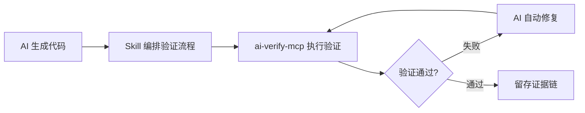
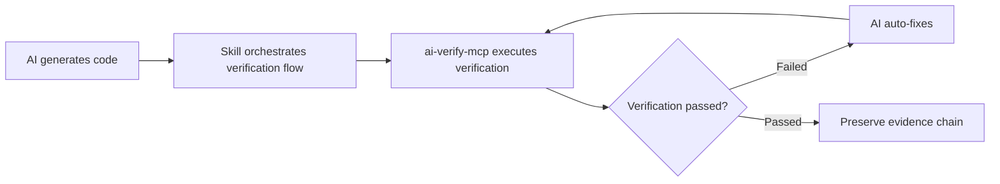

# ValidPilot Verify

> **Don't just generate, verify.**
>
> 让 AI 代码生成结果可验证、可信赖。证据驱动的 MCP 验证平台。

🌐 English version see below / 英文版本见下方

[](https://www.npmjs.com/package/ai-verify-mcp)
[](https://www.npmjs.com/package/ai-verify-mcp)
[](https://github.com/validpilot/ai-verify-mcp/actions/workflows/ci.yml)
[](LICENSE)
[]()
[]()
[](CODE_OF_CONDUCT.md)

> 📘 **MCP 新手？** 先看 [MCP 协议速查手册](docs/MCP-CHEATSHEET.md) — 5 分钟搞懂 MCP。
> 📖 **详细操作指南？** 看 [用户操作手册](docs/USER-MANUAL.md) — 从安装到精通。
> 🔧 **遇到问题？** 看 [日志排查手册](docs/LOG-TROUBLESHOOTING.md) — 常见错误与解决方案。

---

## 📑 目录

- [🎯 一句话介绍](#-一句话介绍)
- [🔄 Skill + MCP = 最佳体验](#-skill--mcp--最佳体验)
- [⚡ 快速开始](#-快速开始)
- [🔧 配置 MCP Server](#-配置-mcp-server)
- [🎬 实际使用示例](#-实际使用示例)
- [🏆 为什么选择 ValidPilot Verify？](#-为什么选择-validpilot-verify)
- [📦 完整工具列表](#-完整工具列表)
- [🔬 证据链概念](#-证据链概念)
- [⚙️ 环境变量](#️-环境变量)
- [❓ 常见问题](#-常见问题)
- [🔌 MCP Client 配置速查](#-mcp-client-配置速查)
- [🎬 演示：✅ vs ❌ 对比](#-演示-vs--对比)
- [📦 发布自动化](#-发布自动化)
- [🙏 致谢](#-致谢)
- [💬 社区与联系](#-社区与联系)
- [❤️ 支持捐赠](#️-支持捐赠)

---

## 🎯 一句话介绍

**ValidPilot Verify** 是一个面向 AI 编程的验证平台。通过 MCP 协议，AI 可以自动验证代码生成结果——**生成截图证据、诊断错误根因、留存完整证据链**。

> **💡 最佳使用方式**：配合 AI IDE（如 Trae）的 **Skill 系统** 使用，形成「生成 → 验证 → 修复 → 复验」的完整内循环。Skill 负责协调验证流程，ai-verify-mcp 提供 77 个底层验证工具，两者组合效果远优于单独使用。

### 它能做什么？

- 🔍 **验证 AI 生成的代码** — 打开页面、点击按钮、填写表单、验证结果
- 📸 **留存证据链** — 每步操作自动截图，形成可追溯的证据链
- 🐛 **智能诊断错误** — 自动分析错误根因，给出置信度评分和修复建议
- ✅ **断言验证** — 验证元素存在、文本内容、URL 匹配等
- 📊 **生成验证报告** — Markdown 报告，包含截图证据和诊断结果

---

## 🔄 Skill + MCP = 最佳体验

ai-verify-mcp 提供 77 个**底层验证工具**（浏览器操作、截图、a11y 扫描、断言验证等），但这些工具需要被**编排调用**才能完成完整的验证任务。

**Skill 系统**（如 Trae 的 `browser-dev-full-validation-skill`）正是这个编排层——它定义了一套标准验证流程：



### Skill 负责

| 职责 | 说明 |
|------|------|
| **流程编排** | 定义验证步骤顺序：打开页面 → 截图 → 检查 a11y → 断言结果 |
| **证据管理** | 统一存放截图、日志、HAR 文件到各阶段产物目录 |
| **生成验证报告** | 将多轮验证结果汇总为一份完整报告（成功率、故障清单、修复建议） |
| **对比基准** | 对比当前验证结果与上一轮（或原始版本），计算回归情况 |

### ai-verify-mcp 负责

| 职责 | 说明 |
|------|------|
| **77 个原子验证工具** | `browser_open` / `browser_screenshot` / `browser_a11y_check` / `browser_assert` / `console_error_check` / `network_check` 等 |
| **证据链采集** | 每步操作自动截图，记录 Console 日志和网络请求 |
| **对比度/CSS 变量扫描** | axe-core 集成、CSS 变量追踪 |
| **报告输出** | 结构化 JSON + Markdown 报告 |

> 💡 **最佳实践**：在 Trae 中同时启用 `browser-dev-full-validation-skill` + `ai-verify-mcp` MCP Server。Skill 自动编排 7 阶段验证流程，ai-verify-mcp 提供底层执行能力。**两者缺一不可**——只有 MCP 缺乏编排，只有 Skill 缺乏执行能力。

---

## ⚡ 快速开始

### 方式一：5 分钟快速体验

```bash
# 1. 安装
npm install ai-verify-mcp

# 2. 启动服务
npx ai-verify-mcp start

# 3. 在 AI 助手中配置 MCP（以 Cursor 为例）
```

### 方式二：直接验证（无需 MCP）

```bash
# 快速验证一个网页
npx ai-verify-mcp validate --url https://example.com

# 截图留证
npx ai-verify-mcp screenshot --url https://example.com --name evidence-001

# 一键检查
npx ai-verify-mcp quick-check --url https://example.com
```

---

## 🔧 配置 MCP Server

### 在 Cursor 中使用

1. 打开 Cursor → 设置 → MCP Servers → Add
2. 填写配置：

在 IDE 的 MCP 配置文件中添加（项目级 `.cursor/mcp.json` 或用户级配置）：

```json
{
  "ai-verify-mcp": {
    "command": "npx",
    "args": ["-y", "ai-verify-mcp"],
    "env": {
      "MCP_MODE": "http",
      "MCP_HTTP_PORT": "3456"
    }
  }
}
```

### 在 Claude Code 中使用

在项目根目录创建 `.mcp.json`：

```json
{
  "mcpServers": {
    "ai-verify-mcp": {
      "command": "npx",
      "args": ["-y", "ai-verify-mcp"],
      "env": {
        "MCP_MODE": "http",
        "MCP_HTTP_PORT": "3456"
      }
    }
  }
}
```

### 在 Windsurf 中使用

Settings → MCP Servers → Add：

```json
{
  "ai-verify-mcp": {
    "command": "npx",
    "args": ["-y", "ai-verify-mcp"]
  }
}
```

---

## 🎬 实际使用示例

### 场景：验证 AI 生成的登录页面

**你告诉 AI：**
> "帮我验证这个登录页面：打开 https://example.com/login，输入用户名 test 和密码 123，点击登录按钮，验证是否跳转到首页。"

**AI 调用的工具链：**

```
1. browser_open → 打开登录页面（截图：login-page.png）
2. browser_type → 输入用户名（截图：username-filled.png）
3. browser_type → 输入密码（截图：password-filled.png）
4. browser_click → 点击登录按钮（截图：login-clicked.png）
5. validation_check → 验证跳转到首页（截图：homepage.png）
6. browser_assert → 断言 URL 包含 /home（生成证据报告）
```

**结果：完整证据链**

```
artifacts/
├── login-page.png          # 页面初始状态
├── username-filled.png     # 输入用户名后
├── password-filled.png     # 输入密码后
├── login-clicked.png       # 点击登录后
├── homepage.png            # 登录成功后
└── validation-report.md    # 验证报告（含诊断结果）
```

---

## 🏆 为什么选择 ValidPilot Verify？

| 特性 | ValidPilot Verify | Playwright | Puppeteer |
|------|-------------------|------------|-----------|
| **MCP 协议原生** | ✅ 开箱即用 | ❌ 需自己封装 | ❌ 需自己封装 |
| **AI Agent 友好** | ✅ 77个专用工具 | ❌ 通用API | ❌ 通用API |
| **证据链留存** | ✅ 自动截图 + 时间戳 | ❌ 手动实现 | ❌ 手动实现 |
| **智能诊断** | ✅ 错误根因 + 置信度 | ❌ 仅日志 | ❌ 仅日志 |
| **验证报告** | ✅ Markdown + 截图 | ❌ 需自己写 | ❌ 需自己写 |
| **快速验证** | ✅ 一键检查7项 | ❌ 需编写测试 | ❌ 需编写测试 |

**核心差异**：Playwright/Puppeteer 是"手"（负责操作），ValidPilot Verify 是"眼+脑"（负责检查和验证）。

### Skill + MCP 协同优势

| 单独用 MCP | 单独用 Skill | **Skill + MCP 组合** |
|-----------|------------|-------------------|
| 有 77 个工具但需手动编排 | 有流程但缺执行能力 | ✅ 自动编排 + 自动执行 |
| 验证结果零散 | 流程模板固定 | ✅ 完整证据链 + 灵活配置 |
| 需手动对比差异 | 无法直接操控浏览器 | ✅ 全自动闭环 |

> ✅ **推荐配置**：在 Trae 中启用 `browser-dev-full-validation-skill`，同时配置 `ai-verify-mcp` 为 MCP Server。Skill 负责"什么时候验、验什么"，MCP 负责"怎么验"。

---

## 📦 完整工具列表

### ✅ 验证框架（14个）

| 工具 | 说明 |
|------|------|
| `validation_check` | 检查点验证（负载时间、JS错误、HTTP错误等）|
| `validation_element` | 元素状态验证（存在、可见、文本包含等）|
| `validation_flow` | 流程验证（多步骤验证流程）|
| `validation_quick_run` | 一键快速验证（7项检查）|
| `validation_report` | 生成验证报告 |
| `validation_report_export` | 导出验证报告 |
| `browser_assert` | 断言验证（URL、标题、元素等）|
| `screenshot_diff` | 视觉回归对比 |

### 🔍 智能诊断（12个）

| 工具 | 说明 |
|------|------|
| `browser_diagnose` | 错误自动诊断（根因分析 + 置信度）|
| `browser_element_status` | 元素状态检查（可见性、可交互性、遮挡）|
| `browser_quick_fix` | 快速修复（8种策略自动尝试）|
| `browser_verify_fix` | 修复验证闭环 |
| `browser_debug_report` | 调试报告生成 |
| `browser_errors_aggregate` | 错误聚合统计 |
| `error_fix_suggestion` | 修复建议（基于规则）|
| `error_summary_md` | 错误摘要（Markdown）|
| `debug_investigate` | 深度调查 |

### 📸 证据收集（6个）

| 工具 | 说明 |
|------|------|
| `browser_screenshot` | 全屏截图 |
| `browser_screenshot_element` | 元素截图 |
| `browser_artifacts` | 工件管理 |
| `browser_artifacts_clear` | 清理工件 |
| `browser_har_export` | 导出 HAR 文件 |
| `browser_snapshot` | 页面快照 |

### 🌐 浏览器操作（21个）

完整浏览器操作能力：打开、点击、输入、滚动、等待、Cookie、存储、网络、控制台等。

### 🎯 智能定位（4个）

| 工具 | 说明 |
|------|------|
| `browser_find_element` | 按文本智能查找元素 |
| `browser_locator_suggest` | 选择器建议 |
| `browser_locator_validate` | 选择器验证 |
| `browser_find_page` | 页面类型识别 |

---

## 🔬 证据链概念

**证据链**是 ValidPilot Verify 的核心概念：

1. **每步操作自动截图** — 时间戳 + 操作类型 + 结果状态
2. **错误自动诊断** — 错误类型 + 根因分析 + 置信度评分
3. **修复建议生成** — 基于规则的修复建议 + 验证闭环
4. **报告自动生成** — Markdown 报告 + 截图引用 + 诊断结果

**示例证据链报告：**

```markdown
# 验证报告 - 登录流程

## ✅ 通过的步骤

| 步骤 | 操作 | 截图 | 时间戳 |
|------|------|------|--------|
| 1 | 打开登录页 | login-page.png | 2026-06-28T10:00:00Z |
| 2 | 输入用户名 | username-filled.png | 2026-06-28T10:00:05Z |
| 3 | 点击登录 | login-clicked.png | 2026-06-28T10:00:10Z |

## ❌ 失败的步骤

| 步骤 | 操作 | 错误 | 截图 | 诊断 |
|------|------|------|------|------|
| 4 | 验证首页 | URL不匹配 | homepage.png | 置信度: 85% - 登录可能失败 |

**错误类型**: 验证失败
**置信度**: 85%
**建议**: 检查登录是否成功，查看是否有错误提示
```

---

## ⚙️ 环境变量

| 变量 | 说明 | 默认值 |
|------|------|--------|
| `MCP_MODE` | MCP 运行模式（stdio/http）| stdio |
| `MCP_HTTP_PORT` | HTTP 端口 | 3456 |
| `VALIDPILOT_ARTIFACTS_DIR` | 证据存放目录 | ./artifacts |
| `SCREENSHOT_QUALITY` | 截图质量 | 80 |

---

## ❓ 常见问题

### Q: 和 browser-mcp 有什么区别？

**browser-mcp** 是"手"——负责操作浏览器（打开、点击、输入）。
**ai-verify-mcp** 是"眼+脑"——负责验证和诊断（检查结果、留存证据、诊断错误）。

两者可以配合使用：browser-mcp 操作，ai-verify-mcp 验证。

### Q: 支持哪些 AI 助手？

支持所有 MCP 协议兼容的 AI 助手：Cursor、Claude Code、Windsurf、Cline 等。

### Q: 证据存放在哪里？

默认存放在 `./artifacts` 目录，包含截图、HAR 文件、验证报告等。

### Q: 启动失败 — `Error: Playwright browser failed to launch`

- **原因 A**: Playwright 浏览器二进制未安装
- **解决**: 运行 `npx playwright install chromium`
- **原因 B**: Linux 系统缺少系统库
- **解决**: Debian/Ubuntu — `apt-get install libnspr4 libnss3 libatk1.0-0 libdrm2 libxkbcommon0 libxcomposite1 libxdamage1 libxfixes3 libxrandr2 libgbm1 libasound2`

### Q: MCP 连接失败 — `MCP error -32000: Connection closed`

- **原因**: `node` 可执行文件路径在 MCP Host 里找不到
- **解决**: 在 MCP config 中使用 `command: "npx" args: ["-y", "ai-verify-mcp"]` 而非 `node .../start-http.js`

### Q: 端口 3456 已被占用

- **解决**: 在 MCP config 中指定自定义端口: `"env": { "MCP_HTTP_PORT": "3557" }`

### Q: 截图没生成到 ./artifacts

- **检查 1**: 进程对当前目录有写权限
- **检查 2**: 通过环境变量覆盖: `"env": { "VALIDPILOT_ARTIFACTS_DIR": "C:/temp/evidence" }`
- **检查 3**: AI 是否真的调用了 `browser_screenshot` 工具（在 MCP 调试模式下看 ListTools 调用日志）

---

## 🔌 MCP Client 配置速查

> 所有客户端的 stdio/HTTP shape 一致，下面列出**可直接复制粘贴**的配置块。

### ✅ Cursor（项目级推荐）

`.cursor/mcp.json`（项目根目录）：

```json
{
  "mcpServers": {
    "ai-verify-mcp": {
      "command": "npx",
      "args": ["-y", "ai-verify-mcp"],
      "env": {
        "MCP_HTTP_PORT": "3456"
      }
    }
  }
}
```

### ✅ Claude Desktop

编辑 `%APPDATA%/Claude/claude_desktop_config.json`（Windows）或 `~/Library/Application Support/Claude/claude_desktop_config.json`（macOS）：

```json
{
  "mcpServers": {
    "ai-verify-mcp": {
      "command": "npx",
      "args": ["-y", "ai-verify-mcp"],
      "env": {
        "MCP_HTTP_PORT": "3456"
      }
    }
  }
}
```

> ⚠️ Claude Desktop 只会加载用户级 config 文件，重启 Claude Desktop 才能看到新工具。

### ✅ Windsurf

`~/.codeium/windsurf/mcp_config.json`：

```json
{
  "mcpServers": {
    "ai-verify-mcp": {
      "command": "npx",
      "args": ["-y", "ai-verify-mcp"],
      "env": {
        "MCP_HTTP_PORT": "3456"
      }
    }
  }
}
```

### ✅ Claude Code（本地安装）

项目根目录的 `.mcp.json`：

```json
{
  "mcpServers": {
    "ai-verify-mcp": {
      "command": "npx",
      "args": ["-y", "ai-verify-mcp"]
    }
  }
}
```

### ✅ Cline / Continue / 其他 stdio MCP 客户端

```json
{
  "name": "ai-verify-mcp",
  "command": "npx",
  "args": ["-y", "ai-verify-mcp"]
}
```

### ✅ Trae IDE

**两种入口二选一，推荐项目级：**

#### 方式 A — 项目级（推荐，多人共享）

在项目根目录创建 `.trae/mcp.json`：

```json
{
  "mcpServers": {
    "ai-verify-mcp": {
      "command": "npx",
      "args": ["-y", "ai-verify-mcp"],
      "env": {
        "MCP_HTTP_PORT": "3456"
      }
    }
  }
}
```

#### 方式 B — 用户级（全局生效）

`%APPDATA%\Trae\User\mcp.json`（Windows）或 `~/.config/Trae/User/mcp.json`（macOS/Linux）：

```json
{
  "mcpServers": {
    "ai-verify-mcp": {
      "command": "npx",
      "args": ["-y", "ai-verify-mcp"],
      "env": {
        "MCP_HTTP_PORT": "3456"
      }
    }
  }
}
```

> 💡 Trae 的 settings → MCP → "+ Add" → "Raw Config (JSON)" 按钮可直接弹出对应路径；保存后重启 Trae 会话加载新工具。

#### ⚠️ Trae MCP 限制提醒

Trae 因模型上下文窗口有限，对 MCP 引入了**两道硬性上限**：

| 限制项 | 上限值 | 触达后果 |
|--------|--------|---------|
| 所有 MCP Server **工具描述总字符数** | ≤ 8000 字符 | 超出后**按工具粒度丢弃**多余的工具描述 |
| 所有 MCP Server **工具总数** | ≤ 40 个工具 | 超出后**按工具粒度丢弃**装不下的工具 |

> 📌 数据来源：[Trae 官方 FAQ｜MCP 工具 · 2026-02](https://forum.trae.cn/t/topic/65)

大量堆叠 MCP 后，可能出现"`list tools failed`"或工具显示不全的现象——并非 ai-verify-mcp 自身问题，而是触达 Trae 上限后按工具粒度丢失描述。具体规避措施请参考 Trae 官方文档。

### ✅ Codex CLI（OpenAI）

`~/.codex/config.toml`（**TOML 格式**，注意与 JSON 区别）：

```toml
[mcp_servers.ai-verify-mcp]
command = "npx"
args = ["-y", "ai-verify-mcp"]

[mcp_servers.ai-verify-mcp.env]
MCP_HTTP_PORT = "3456"
```

或使用 CLI 一次性添加：

```bash
codex mcp add ai-verify-mcp -- npx -y ai-verify-mcp
```

> 💡 Codex CLI 默认走 stdio，HTTP 端口仅在 `MCP_MODE=http` 时使用；如需走 HTTP 暴露给浏览器调试，需在 `start-http.js` 启动后让 Codex 通过 SSE/HTTP 连接（Codex 0.40+ 支持）。

### ✅ OpenClaw（开源 Claude Code 替代品）

`~/.openclaw/openclaw.json`：

```json
{
  "mcp": {
    "servers": {
      "ai-verify-mcp": {
        "command": "npx",
        "args": ["-y", "ai-verify-mcp"],
        "env": {
          "MCP_HTTP_PORT": "3456"
        }
      }
    }
  }
}
```

> 💡 OpenClaw 使用 `mcp.servers.<name>` 嵌套结构（不带 servers 后缀是另一种风格），与 Claude Code 同源协议，可平滑迁移。

### ✅ Hermes Agent（Nous Research）

`~/.hermes/config.yaml`（YAML 格式，与 JSON 路径不同）：

```yaml
mcp_servers:
  ai-verify-mcp:
    command: "npx"
    args: ["-y", "ai-verify-mcp"]
    env:
      MCP_HTTP_PORT: "3456"
```

或使用 CLI 交互式添加：

```bash
hermes mcp add ai-verify-mcp \
  --command "npx" \
  --args "-y,ai-verify-mcp"
```

> 💡 Hermes 会自动 discover 工具列表，启动后用 `hermes tools list` 可看到 `browser_*`、`validation_*` 等工具已注册。

### ✅ 华为云 CodeArts（码道 IDE）

设置 → MCP工具 → "配置MCP" → 编辑 `mcp_settings.json`：

```json
{
  "mcpServers": {
    "ai-verify-mcp": {
      "command": "npx",
      "args": ["-y", "ai-verify-mcp"],
      "env": {
        "MCP_HTTP_PORT": "3456"
      }
    }
  }
}
```

或在 IDE 命令面板执行：

1. `Ctrl+Shift+P` → "CodeArts: Add MCP Server"
2. 选 stdio → 填 `npx` 和 `-y,ai-verify-mcp`
3. 配置自动写入 `mcp_settings.json`

> ⚠️ 华为云码道**建议开启 MCP ≤ 8 个，启用 3 个最优**，本工具是验证类，建议与 Playwright、Context7 等共用并设置 defer_loading 避免冲突。

### ✅ Tencent CodeBuddy

**方式 A — 推荐：`~/.codebuddy/.mcp.json`（推荐）**

`~/.codebuddy/.mcp.json`（全局）或项目根 `.mcp.json`（项目级）：

```json
{
  "mcpServers": {
    "ai-verify-mcp": {
      "command": "npx",
      "args": ["-y", "ai-verify-mcp"],
      "env": {
        "MCP_HTTP_PORT": "3456"
      }
    }
  }
}
```

**方式 B — Settings.json 集成**

设置 → "Add MCP" → 自动打开 `settings.json`，追加：

```json
{
  "mcpServers": {
    "ai-verify-mcp": {
      "command": "npx",
      "args": ["-y", "ai-verify-mcp"]
    }
  }
}
```

> 💡 CodeBuddy 支持 STDIO / SSE / HTTP 三种 transports，本节配置均为 STDIO（最常用）；如需走 HTTP 模式，把 `command/args` 替换为 `url: "http://localhost:3456/sse"` 即可。

---

## 🎬 演示：✅ vs ❌ 对比

### ❌ 没有验证（普通 AI 编程）

```
👤 "帮我写一个登录页"
🤖 "已生成 login.html / login.js ... ✅"
👤 "能跑吗？"
🤖 "应该没问题"
👤 "......"   ← 没有证据
```

### ✅ 有 ValidPilot Verify

```
👤 "帮我写一个登录页，跑完之后验证一下"
🤖 "好的，我边写边验证：
    1. 打开页面 → validation_quick_run ✅
    2. 输入用户名 → screenshot 已留证
    3. 输入密码 → screenshot 已留证
    4. 点击登录 → screenshot + URL断言 ✅
    5. 验证首页 → evidence/report.md ✅"
👤 *(点击 evidence/login-flow-report.md 查看截图证据链)*
```

完整证据链文件结构：

```
artifacts/
├── step-1-login-page.png
├── step-2-username-typed.png
├── step-3-password-typed.png
├── step-4-login-clicked.png
├── step-5-home-verified.png
└── login-flow-report.md
```

---

## 📦 发布自动化

发布到 npm 时会自动执行健康校验：

```json
{
  "scripts": {
    "start": "node server.js",
    "http": "node start-http.js",
    "cli": "node bin/validpilot.js",
    "validate": "node bin/validpilot.js health",
    "pack:dry": "npm pack --dry-run",
    "prepublishOnly": "node bin/validpilot.js health && npm pack --dry-run"
  }
}
```

执行流程：
```bash
$ npm publish
> ai-verify-mcp@1.0.0 prepublishOnly
> node bin/validpilot.js health && npm pack --dry-run

{ "ok": true, "name": "ai-verify-mcp", "version": "1.0.0", ... }
npm notice package size: 102.4 kB
npm notice total files: 101
+ npm publish → 上传 npm registry
```

发布前可手动验证：
- `npm run validate` — Playwright 健康检查
- `npm run pack:dry` — 打包预览（不实际打包）

---

## 🙏 致谢

感谢以下项目和技术的启发：
- [Playwright](https://playwright.dev/) — 浏览器自动化引擎
- [@modelcontextprotocol/sdk](https://github.com/modelcontextprotocol/typescript-sdk) — MCP 协议 SDK
- [axe-core](https://github.com/dequelabs/axe-core) — 无障碍检查

---

## 💬 社区与联系

### 钉钉交流群

扫码加入 `ai-verify-mcp` 官方交流群，提问、反馈、交流最佳实践：


> 此二维码永久有效

### 联系邮箱

📧 [validpilot@outlook.com](mailto:validpilot@outlook.com)

- 商务合作
- 安全漏洞报告（请优先使用 [SECURITY.md](SECURITY.md) 流程）
- 其他问题

---

## ❤️ 支持捐赠

感谢您对本项目的关注与支持！

如果您觉得这个项目对您有帮助，或者希望支持我持续开发和维护，欢迎通过捐赠的方式给予鼓励。您的每一份支持，都是我继续前行的动力！

捐赠将用于项目维护、功能开发、服务器开销等，所有资金将透明公开，专款专用。

### 捐赠方式

| 支付宝 | 微信支付 |
|:---:|:---:|
|  |  |

> 无论金额大小，都是对我莫大的鼓励。再次感谢您的支持！

> **PayPal / GitHub Sponsors**：暂未开通，敬请期待。

---

**Contributing** — 欢迎贡献！阅读 [CONTRIBUTING.md](CONTRIBUTING.md) 了解如何参与。请遵守 [Code of Conduct](CODE_OF_CONDUCT.md)。

**Security** — 发现漏洞？查看 [SECURITY.md](SECURITY.md) 了解安全策略。

**AI Agents** — 你是 AI Agent？查看 [AGENTS.md](AGENTS.md) 获取编码指南和项目约定。

**License** — [MIT](LICENSE) © 2026 ValidPilot

## 📜 许可证

[MIT](LICENSE) © 2026 ValidPilot Team

---

> **Don't just generate, verify.** — 让 AI 编程可信赖。

---

## English Version

# ValidPilot Verify

> **Don't just generate, verify.**
>
> Make AI code generation verifiable and trustworthy. Evidence-driven MCP verification platform.

[](https://www.npmjs.com/package/ai-verify-mcp)
[](https://www.npmjs.com/package/ai-verify-mcp)
[](https://github.com/validpilot/ai-verify-mcp/actions/workflows/ci.yml)
[](LICENSE)
[]()
[]()
[](CODE_OF_CONDUCT.md)

> 📘 **New to MCP?** Start with [MCP Protocol Cheatsheet](docs/MCP-CHEATSHEET.md) — understand MCP in 5 minutes.
> 📖 **Detailed user guide?** See [User Manual](docs/USER-MANUAL.md) — from installation to mastery.
> 🔧 **Having issues?** See [Log Troubleshooting Guide](docs/LOG-TROUBLESHOOTING.md) — common errors and solutions.

---

## 📑 Table of Contents

- [🎯 One-Sentence Introduction](#-one-sentence-introduction)
- [🔄 Skill + MCP = Best Experience](#-skill--mcp--best-experience)
- [⚡ Quick Start](#-quick-start)
- [🔧 Configure MCP Server](#-configure-mcp-server)
- [🎬 Practical Usage Examples](#-practical-usage-examples)
- [🏆 Why Choose ValidPilot Verify?](#-why-choose-validpilot-verify)
- [📦 Complete Tool List](#-complete-tool-list)
- [🔬 Evidence Chain Concept](#-evidence-chain-concept)
- [⚙️ Environment Variables](#️-environment-variables)
- [❓ FAQ](#-faq)
- [🔌 MCP Client Configuration Quick Reference](#-mcp-client-configuration-quick-reference)
- [🎬 Demo: ✅ vs ❌ Comparison](#-demo-vs--comparison)
- [📦 Release Automation](#-release-automation)
- [🙏 Acknowledgments](#-acknowledgments)
- [💬 Community & Contact](#-community--contact)
- [❤️ Support the Project](#️-support-the-project)

---

## 🎯 One-Sentence Introduction

**ValidPilot Verify** is a verification platform for AI programming. Through the MCP protocol, AI can automatically verify code generation results — **generating screenshot evidence, diagnosing error root causes, and preserving a complete evidence chain**.

> **💡 Best Practice**: Use with the **Skill system** of AI IDEs (like Trae) to form a complete inner loop of "generate → verify → fix → re-verify". Skill coordinates the verification process, and ai-verify-mcp provides 77 underlying verification tools. The combination is far more effective than using either alone.

### What can it do?

- 🔍 **Verify AI-generated code** — open pages, click buttons, fill forms, validate results
- 📸 **Preserve evidence chain** — automatic screenshots at each step, forming a traceable evidence chain
- 🐛 **Intelligent error diagnosis** — automatic root cause analysis with confidence scores and fix suggestions
- ✅ **Assertion verification** — verify element existence, text content, URL matching, etc.
- 📊 **Generate verification reports** — Markdown reports with screenshot evidence and diagnosis results

---

## 🔄 Skill + MCP = Best Experience

ai-verify-mcp provides 77 **underlying verification tools** (browser operations, screenshots, a11y scanning, assertion verification, etc.), but these tools need to be **orchestrated** to complete a full verification task.

The **Skill system** (like Trae's `browser-dev-full-validation-skill`) is precisely this orchestration layer — it defines a standard verification process:



### Skill is Responsible For

| Responsibility | Description |
|------|------|
| **Process Orchestration** | Define verification step order: open page → screenshot → check a11y → assert results |
| **Evidence Management** | Unified storage of screenshots, logs, HAR files in each phase's artifact directory |
| **Generate Verification Reports** | Summarize multi-round verification results into a complete report (success rate, fault list, fix suggestions) |
| **Baseline Comparison** | Compare current verification results with previous round (or original version) to calculate regression |

### ai-verify-mcp is Responsible For

| Responsibility | Description |
|------|------|
| **77 Atomic Verification Tools** | `browser_open` / `browser_screenshot` / `browser_a11y_check` / `browser_assert` / `console_error_check` / `network_check`, etc. |
| **Evidence Chain Collection** | Automatic screenshots at each step, recording Console logs and network requests |
| **Contrast/CSS Variable Scanning** | axe-core integration, CSS variable tracking |
| **Report Output** | Structured JSON + Markdown reports |

> 💡 **Best Practice**: Enable both `browser-dev-full-validation-skill` + `ai-verify-mcp` MCP Server in Trae. Skill automatically orchestrates the 7-phase verification process, and ai-verify-mcp provides the underlying execution capability. **Both are essential** — MCP alone lacks orchestration, Skill alone lacks execution capability.

---

## ⚡ Quick Start

### Method 1: 5-Minute Quick Experience

```bash
# 1. Install
npm install ai-verify-mcp

# 2. Start the service
npx ai-verify-mcp start

# 3. Configure MCP in your AI assistant (using Cursor as example)
```

### Method 2: Direct Verification (No MCP Required)

```bash
# Quickly verify a webpage
npx ai-verify-mcp validate --url https://example.com

# Take screenshot for evidence
npx ai-verify-mcp screenshot --url https://example.com --name evidence-001

# One-click check
npx ai-verify-mcp quick-check --url https://example.com
```

---

## 🔧 Configure MCP Server

### Using with Cursor

1. Open Cursor → Settings → MCP Servers → Add
2. Fill in the configuration:

Add to the IDE's MCP configuration file (project-level `.cursor/mcp.json` or user-level configuration):

```json
{
  "ai-verify-mcp": {
    "command": "npx",
    "args": ["-y", "ai-verify-mcp"],
    "env": {
      "MCP_MODE": "http",
      "MCP_HTTP_PORT": "3456"
    }
  }
}
```

### Using with Claude Code

Create `.mcp.json` in the project root directory:

```json
{
  "mcpServers": {
    "ai-verify-mcp": {
      "command": "npx",
      "args": ["-y", "ai-verify-mcp"],
      "env": {
        "MCP_MODE": "http",
        "MCP_HTTP_PORT": "3456"
      }
    }
  }
}
```

### Using with Windsurf

Settings → MCP Servers → Add:

```json
{
  "ai-verify-mcp": {
    "command": "npx",
    "args": ["-y", "ai-verify-mcp"]
  }
}
```

---

## 🎬 Practical Usage Examples

### Scenario: Verify an AI-Generated Login Page

**You tell AI:**
> "Help me verify this login page: open https://example.com/login, enter username test and password 123, click the login button, and verify if it redirects to the homepage."

**Tool chain called by AI:**

```
1. browser_open → Open login page (screenshot: login-page.png)
2. browser_type → Enter username (screenshot: username-filled.png)
3. browser_type → Enter password (screenshot: password-filled.png)
4. browser_click → Click login button (screenshot: login-clicked.png)
5. validation_check → Verify redirect to homepage (screenshot: homepage.png)
6. browser_assert → Assert URL contains /home (generate evidence report)
```

**Result: Complete evidence chain**

```
artifacts/
├── login-page.png          # Initial page state
├── username-filled.png     # After entering username
├── password-filled.png     # After entering password
├── login-clicked.png       # After clicking login
├── homepage.png            # After successful login
└── validation-report.md    # Verification report (with diagnosis results)
```

---

## 🏆 Why Choose ValidPilot Verify?

| Feature | ValidPilot Verify | Playwright | Puppeteer |
|------|-------------------|------------|-----------|
| **Native MCP Protocol** | ✅ Out of the box | ❌ Requires custom wrapping | ❌ Requires custom wrapping |
| **AI Agent Friendly** | ✅ 77 dedicated tools | ❌ General-purpose API | ❌ General-purpose API |
| **Evidence Chain Preservation** | ✅ Auto screenshots + timestamps | ❌ Manual implementation | ❌ Manual implementation |
| **Intelligent Diagnosis** | ✅ Root cause + confidence | ❌ Logs only | ❌ Logs only |
| **Verification Reports** | ✅ Markdown + screenshots | ❌ Requires custom coding | ❌ Requires custom coding |
| **Quick Verification** | ✅ One-click 7-item check | ❌ Requires writing tests | ❌ Requires writing tests |

**Core difference**: Playwright/Puppeteer are the "hands" (responsible for operations), ValidPilot Verify is the "eyes + brain" (responsible for checking and verification).

### Skill + MCP Synergy Advantages

| MCP Alone | Skill Alone | **Skill + MCP Combination** |
|-----------|------------|-------------------|
| 77 tools but requires manual orchestration | Has process but lacks execution capability | ✅ Auto-orchestration + auto-execution |
| Scattered verification results | Fixed process templates | ✅ Complete evidence chain + flexible configuration |
| Requires manual diff comparison | Cannot directly control browser | ✅ Fully automated closed loop |

> ✅ **Recommended Configuration**: Enable `browser-dev-full-validation-skill` in Trae, and configure `ai-verify-mcp` as an MCP Server. Skill is responsible for "when to verify, what to verify", and MCP is responsible for "how to verify".

---

## 📦 Complete Tool List

### ✅ Verification Framework (14 tools)

| Tool | Description |
|------|------|
| `validation_check` | Checkpoint verification (load time, JS errors, HTTP errors, etc.) |
| `validation_element` | Element state verification (existence, visibility, text contains, etc.) |
| `validation_flow` | Flow verification (multi-step verification process) |
| `validation_quick_run` | One-click quick verification (7 checks) |
| `validation_report` | Generate verification report |
| `validation_report_export` | Export verification report |
| `browser_assert` | Assertion verification (URL, title, elements, etc.) |
| `screenshot_diff` | Visual regression comparison |

### 🔍 Intelligent Diagnosis (12 tools)

| Tool | Description |
|------|------|
| `browser_diagnose` | Automatic error diagnosis (root cause analysis + confidence) |
| `browser_element_status` | Element status check (visibility, interactivity, occlusion) |
| `browser_quick_fix` | Quick fix (8 strategies auto-tried) |
| `browser_verify_fix` | Fix verification closed loop |
| `browser_debug_report` | Debug report generation |
| `browser_errors_aggregate` | Error aggregation statistics |
| `error_fix_suggestion` | Fix suggestions (rule-based) |
| `error_summary_md` | Error summary (Markdown) |
| `debug_investigate` | Deep investigation |

### 📸 Evidence Collection (6 tools)

| Tool | Description |
|------|------|
| `browser_screenshot` | Full-page screenshot |
| `browser_screenshot_element` | Element screenshot |
| `browser_artifacts` | Artifact management |
| `browser_artifacts_clear` | Clear artifacts |
| `browser_har_export` | Export HAR file |
| `browser_snapshot` | Page snapshot |

### 🌐 Browser Operations (21 tools)

Full browser operation capabilities: open, click, type, scroll, wait, cookies, storage, network, console, etc.

### 🎯 Intelligent Locator (4 tools)

| Tool | Description |
|------|------|
| `browser_find_element` | Intelligent element finding by text |
| `browser_locator_suggest` | Selector suggestions |
| `browser_locator_validate` | Selector validation |
| `browser_find_page` | Page type recognition |

---

## 🔬 Evidence Chain Concept

**Evidence chain** is the core concept of ValidPilot Verify:

1. **Automatic screenshots at each step** — timestamp + operation type + result status
2. **Automatic error diagnosis** — error type + root cause analysis + confidence score
3. **Fix suggestion generation** — rule-based fix suggestions + verification closed loop
4. **Automatic report generation** — Markdown report + screenshot references + diagnosis results

**Example evidence chain report:**

```markdown
# Verification Report - Login Flow

## ✅ Passed Steps

| Step | Action | Screenshot | Timestamp |
|------|------|------|--------|
| 1 | Open login page | login-page.png | 2026-06-28T10:00:00Z |
| 2 | Enter username | username-filled.png | 2026-06-28T10:00:05Z |
| 3 | Click login | login-clicked.png | 2026-06-28T10:00:10Z |

## ❌ Failed Steps

| Step | Action | Error | Screenshot | Diagnosis |
|------|------|------|------|------|
| 4 | Verify homepage | URL mismatch | homepage.png | Confidence: 85% - Login may have failed |

**Error type**: Verification failed
**Confidence**: 85%
**Suggestion**: Check if login was successful, look for error messages
```

---

## ⚙️ Environment Variables

| Variable | Description | Default |
|------|------|--------|
| `MCP_MODE` | MCP operation mode (stdio/http) | stdio |
| `MCP_HTTP_PORT` | HTTP port | 3456 |
| `VALIDPILOT_ARTIFACTS_DIR` | Evidence storage directory | ./artifacts |
| `SCREENSHOT_QUALITY` | Screenshot quality | 80 |

---

## ❓ FAQ

### Q: What's the difference from browser-mcp?

**browser-mcp** is the "hand" — responsible for operating the browser (open, click, type).
**ai-verify-mcp** is the "eyes + brain" — responsible for verification and diagnosis (check results, preserve evidence, diagnose errors).

The two can be used together: browser-mcp operates, ai-verify-mcp verifies.

### Q: Which AI assistants are supported?

All MCP protocol-compatible AI assistants are supported: Cursor, Claude Code, Windsurf, Cline, etc.

### Q: Where is evidence stored?

By default in the `./artifacts` directory, including screenshots, HAR files, verification reports, etc.

### Q: Startup failure — `Error: Playwright browser failed to launch`

- **Cause A**: Playwright browser binary not installed
- **Solution**: Run `npx playwright install chromium`
- **Cause B**: Linux system missing system libraries
- **Solution**: Debian/Ubuntu — `apt-get install libnspr4 libnss3 libatk1.0-0 libdrm2 libxkbcommon0 libxcomposite1 libxdamage1 libxfixes3 libxrandr2 libgbm1 libasound2`

### Q: MCP connection failure — `MCP error -32000: Connection closed`

- **Cause**: `node` executable path not found in MCP Host
- **Solution**: Use `command: "npx" args: ["-y", "ai-verify-mcp"]` in MCP config instead of `node .../start-http.js`

### Q: Port 3456 is already in use

- **Solution**: Specify a custom port in MCP config: `"env": { "MCP_HTTP_PORT": "3557" }`

### Q: Screenshots not generated to ./artifacts

- **Check 1**: Process has write permission to the current directory
- **Check 2**: Override via environment variable: `"env": { "VALIDPILOT_ARTIFACTS_DIR": "C:/temp/evidence" }`
- **Check 3**: Whether AI actually called `browser_screenshot` tool (check ListTools call logs in MCP debug mode)

---

## 🔌 MCP Client Configuration Quick Reference

> All clients have consistent stdio/HTTP shape, below are **copy-paste-ready** configuration blocks.

### ✅ Cursor (project-level recommended)

`.cursor/mcp.json` (project root directory):

```json
{
  "mcpServers": {
    "ai-verify-mcp": {
      "command": "npx",
      "args": ["-y", "ai-verify-mcp"],
      "env": {
        "MCP_HTTP_PORT": "3456"
      }
    }
  }
}
```

### ✅ Claude Desktop

Edit `%APPDATA%/Claude/claude_desktop_config.json` (Windows) or `~/Library/Application Support/Claude/claude_desktop_config.json` (macOS):

```json
{
  "mcpServers": {
    "ai-verify-mcp": {
      "command": "npx",
      "args": ["-y", "ai-verify-mcp"],
      "env": {
        "MCP_HTTP_PORT": "3456"
      }
    }
  }
}
```

> ⚠️ Claude Desktop only loads user-level config files, restart Claude Desktop to see new tools.

### ✅ Windsurf

`~/.codeium/windsurf/mcp_config.json`:

```json
{
  "mcpServers": {
    "ai-verify-mcp": {
      "command": "npx",
      "args": ["-y", "ai-verify-mcp"],
      "env": {
        "MCP_HTTP_PORT": "3456"
      }
    }
  }
}
```

### ✅ Claude Code (local installation)

`.mcp.json` in project root directory:

```json
{
  "mcpServers": {
    "ai-verify-mcp": {
      "command": "npx",
      "args": ["-y", "ai-verify-mcp"]
    }
  }
}
```

### ✅ Cline / Continue / Other stdio MCP Clients

```json
{
  "name": "ai-verify-mcp",
  "command": "npx",
  "args": ["-y", "ai-verify-mcp"]
}
```

### ✅ Trae IDE

**Choose one of two entry points, project-level recommended:**

#### Method A — Project-level (recommended, shared by team)

Create `.trae/mcp.json` in the project root directory:

```json
{
  "mcpServers": {
    "ai-verify-mcp": {
      "command": "npx",
      "args": ["-y", "ai-verify-mcp"],
      "env": {
        "MCP_HTTP_PORT": "3456"
      }
    }
  }
}
```

#### Method B — User-level (global effect)

`%APPDATA%\Trae\User\mcp.json` (Windows) or `~/.config/Trae/User/mcp.json` (macOS/Linux):

```json
{
  "mcpServers": {
    "ai-verify-mcp": {
      "command": "npx",
      "args": ["-y", "ai-verify-mcp"],
      "env": {
        "MCP_HTTP_PORT": "3456"
      }
    }
  }
}
```

> 💡 Trae's settings → MCP → "+ Add" → "Raw Config (JSON)" button can directly pop up the corresponding path; restart the Trae session after saving to load new tools.

#### ⚠️ Trae MCP Limit Notice

Due to limited model context window, Trae introduces **two hard limits** for MCP:

| Limit Item | Upper Limit | Consequence |
|--------|--------|---------|
| Total characters of **all MCP Server tool descriptions** | ≤ 8000 characters | Excess will be **discarded at tool granularity** |
| **Total number of tools** across all MCP Servers | ≤ 40 tools | Excess will be **discarded at tool granularity** |

> 📌 Source: [Trae Official FAQ｜MCP Tools · 2026-02](https://forum.trae.cn/t/topic/65)

After stacking many MCPs, you may experience "`list tools failed`" or incomplete tool display — this is not an issue with ai-verify-mcp itself, but rather tool descriptions being dropped at tool granularity after reaching Trae's limits. Please refer to Trae's official documentation for specific mitigation measures.

### ✅ Codex CLI (OpenAI)

`~/.codex/config.toml` (**TOML format**, note the difference from JSON):

```toml
[mcp_servers.ai-verify-mcp]
command = "npx"
args = ["-y", "ai-verify-mcp"]

[mcp_servers.ai-verify-mcp.env]
MCP_HTTP_PORT = "3456"
```

Or add via CLI one-time:

```bash
codex mcp add ai-verify-mcp -- npx -y ai-verify-mcp
```

> 💡 Codex CLI defaults to stdio, HTTP port is only used when `MCP_MODE=http`; if you need HTTP for browser debugging, start `start-http.js` and let Codex connect via SSE/HTTP (Codex 0.40+ supported).

### ✅ OpenClaw (open-source Claude Code alternative)

`~/.openclaw/openclaw.json`:

```json
{
  "mcp": {
    "servers": {
      "ai-verify-mcp": {
        "command": "npx",
        "args": ["-y", "ai-verify-mcp"],
        "env": {
          "MCP_HTTP_PORT": "3456"
        }
      }
    }
  }
}
```

> 💡 OpenClaw uses `mcp.servers.<name>` nested structure (without the servers suffix is another style), same protocol origin as Claude Code, can be smoothly migrated.

### ✅ Hermes Agent (Nous Research)

`~/.hermes/config.yaml` (YAML format, different path from JSON):

```yaml
mcp_servers:
  ai-verify-mcp:
    command: "npx"
    args: ["-y", "ai-verify-mcp"]
    env:
      MCP_HTTP_PORT: "3456"
```

Or add via CLI interactively:

```bash
hermes mcp add ai-verify-mcp \
  --command "npx" \
  --args "-y,ai-verify-mcp"
```

> 💡 Hermes will auto-discover the tool list, after startup use `hermes tools list` to see `browser_*`, `validation_*` etc. tools already registered.

### ✅ Huawei Cloud CodeArts (MaDao IDE)

Settings → MCP Tools → "Configure MCP" → Edit `mcp_settings.json`:

```json
{
  "mcpServers": {
    "ai-verify-mcp": {
      "command": "npx",
      "args": ["-y", "ai-verify-mcp"],
      "env": {
        "MCP_HTTP_PORT": "3456"
      }
    }
  }
}
```

Or execute in IDE command palette:

1. `Ctrl+Shift+P` → "CodeArts: Add MCP Server"
2. Select stdio → fill in `npx` and `-y,ai-verify-mcp`
3. Configuration automatically written to `mcp_settings.json`

> ⚠️ Huawei Cloud MaDao **recommends enabling ≤ 8 MCPs, 3 is optimal**, this tool is verification-type, recommended to share with Playwright, Context7, etc. and set defer_loading to avoid conflicts.

### ✅ Tencent CodeBuddy

**Method A — Recommended: `~/.codebuddy/.mcp.json` (recommended)**

`~/.codebuddy/.mcp.json` (global) or project root `.mcp.json` (project-level):

```json
{
  "mcpServers": {
    "ai-verify-mcp": {
      "command": "npx",
      "args": ["-y", "ai-verify-mcp"],
      "env": {
        "MCP_HTTP_PORT": "3456"
      }
    }
  }
}
```

**Method B — Settings.json integration**

Settings → "Add MCP" → automatically opens `settings.json`, append:

```json
{
  "mcpServers": {
    "ai-verify-mcp": {
      "command": "npx",
      "args": ["-y", "ai-verify-mcp"]
    }
  }
}
```

> 💡 CodeBuddy supports STDIO / SSE / HTTP three transports, configurations in this section are all STDIO (most common); if you need HTTP mode, replace `command/args` with `url: "http://localhost:3456/sse"`.

---

## 🎬 Demo: ✅ vs ❌ Comparison

### ❌ Without Verification (Regular AI Programming)

```
👤 "Write me a login page"
🤖 "Generated login.html / login.js ... ✅"
👤 "Does it work?"
🤖 "Should be fine"
👤 "......"   ← No evidence
```

### ✅ With ValidPilot Verify

```
👤 "Write me a login page, and verify it after you're done"
🤖 "Sure, I'll verify as I write:
    1. Open page → validation_quick_run ✅
    2. Enter username → screenshot saved
    3. Enter password → screenshot saved
    4. Click login → screenshot + URL assertion ✅
    5. Verify homepage → evidence/report.md ✅"
👤 *(Click evidence/login-flow-report.md to view screenshot evidence chain)*
```

Complete evidence chain file structure:

```
artifacts/
├── step-1-login-page.png
├── step-2-username-typed.png
├── step-3-password-typed.png
├── step-4-login-clicked.png
├── step-5-home-verified.png
└── login-flow-report.md
```

---

## 📦 Release Automation

Health checks are automatically executed when publishing to npm:

```json
{
  "scripts": {
    "start": "node server.js",
    "http": "node start-http.js",
    "cli": "node bin/validpilot.js",
    "validate": "node bin/validpilot.js health",
    "pack:dry": "npm pack --dry-run",
    "prepublishOnly": "node bin/validpilot.js health && npm pack --dry-run"
  }
}
```

Execution flow:
```bash
$ npm publish
> ai-verify-mcp@1.0.0 prepublishOnly
> node bin/validpilot.js health && npm pack --dry-run

{ "ok": true, "name": "ai-verify-mcp", "version": "1.0.0", ... }
npm notice package size: 102.4 kB
npm notice total files: 101
+ npm publish → upload to npm registry
```

Manual verification before publishing:
- `npm run validate` — Playwright health check
- `npm run pack:dry` — Package preview (without actual packaging)

---

## 🙏 Acknowledgments

Thanks to the following projects and technologies for inspiration:
- [Playwright](https://playwright.dev/) — Browser automation engine
- [@modelcontextprotocol/sdk](https://github.com/modelcontextprotocol/typescript-sdk) — MCP protocol SDK
- [axe-core](https://github.com/dequelabs/axe-core) — Accessibility checking

---

## 💬 Community & Contact

### DingTalk Group

Scan the QR code to join the official `ai-verify-mcp` DingTalk group for questions, feedback, and best practices:


> This QR code is permanently valid

### Contact Email

📧 [validpilot@outlook.com](mailto:validpilot@outlook.com)

- Business cooperation
- Security vulnerability reports (please use the [SECURITY.md](SECURITY.md) process first)
- Other inquiries

---

## ❤️ Support the Project

Thank you for your interest in this project!

If you find this project helpful or would like to support my ongoing development and maintenance, you're welcome to make a donation. Every contribution, no matter how small, is a great encouragement to me and helps keep this project alive and growing.

Donations will be used for project maintenance, feature development, server costs, and other related expenses. All funds will be used transparently and responsibly.

### Donation Options

| Alipay | WeChat Pay |
|:---:|:---:|
|  |  |

> Thank you again for your support — it means a lot!

> **PayPal / GitHub Sponsors**: Coming soon.

---

**Contributing** — Contributions welcome! Read [CONTRIBUTING.md](CONTRIBUTING.md) to learn how to participate. Please follow the [Code of Conduct](CODE_OF_CONDUCT.md).

**Security** — Found a vulnerability? See [SECURITY.md](SECURITY.md) for security policy.

**AI Agents** — Are you an AI Agent? See [AGENTS.md](AGENTS.md) for coding guidelines and project conventions.

**License** — [MIT](LICENSE) © 2026 ValidPilot

## 📜 License

[MIT](LICENSE) © 2026 ValidPilot Team

---

> **Don't just generate, verify.** — Make AI programming trustworthy.