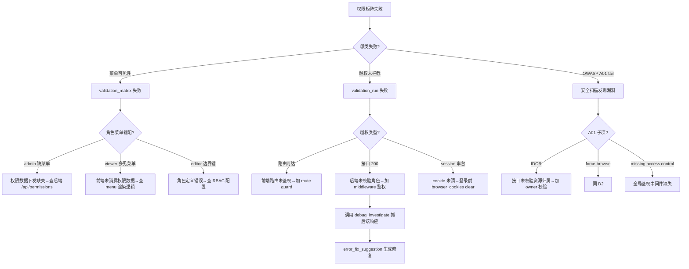

# 场景 Playbook: 后台管理系统权限矩阵

> 场景：后台管理系统的角色权限矩阵验证——不同角色（管理员 admin / 编辑 editor / 查看者 viewer）登录后应看到不同菜单、不同数据、不同操作按钮。权限越权（IDOR / 水平越权 / 垂直越权）是 OWASP A01 访问控制失效的典型表现，一旦泄露将造成数据安全事故。

## 1. 场景背景与业务价值

后台权限是"数据安全的最后一道门"。AI 生成的后台系统常出现：

- 前端隐藏了菜单，但路由未做鉴权，viewer 直接访问 `/admin/users` URL 仍能进入
- 接口未校验角色，viewer 调用 `DELETE /api/users/:id` 竟然成功（垂直越权）
- editor 能看到 admin 才有的"删除"按钮（按钮级权限未控制）
- 不同角色登录后菜单相同（权限数据未下发或前端未消费）
- 切换角色后旧 session 残留，导致权限串台
- 越权访问无审计日志，事故无法追溯

**业务价值**：本 Playbook 用"3 角色 × N 菜单/接口"的矩阵化验证，一次性暴露前端可见性、路由可达性、接口鉴权三层越权风险，把"安全团队人工越权测试 4 小时"压缩到"20 分钟自动矩阵验证"。

**跨 Skill 编排**：本场景组合 3 个 Skill——[登录流程验证](../skills/login-validation)（多角色登录）+ [安全审计](../skills/security-audit)（OWASP A01 访问控制）+ [端到端流程](../skills/e2e-flow)（矩阵化验收）。

## 2. 验证目标（明确通过标准）

| 编号 | 通过标准 | 验证方式 |
|---|---|---|
| G1 | admin 登录后可见全部 6 个菜单 | `validation_matrix`（admin × 6 菜单全可见） |
| G2 | editor 登录后只见 4 个菜单（无"用户管理""系统设置"） | `validation_matrix`（editor × 2 菜单不可见） |
| G3 | viewer 登录后只见 2 个菜单（无"用户管理""系统设置""内容编辑""审核"） | `validation_matrix`（viewer × 4 菜单不可见） |
| G4 | viewer 直接访问 `/admin/users` 路由被拦截（跳转 403 或登录页） | `browser_assert` + `validation_run` |
| G5 | viewer 调用 `DELETE /api/users/:id` 返回 403（接口鉴权） | `browser_network` 查响应码 |
| G6 | OWASP A01（Broken Access Control）状态为 `pass` | `security_owasp_top10` |
| G7 | 角色切换后无 session 残留（重新登录后菜单正确） | 多用例 `validation_run` |
| G8 | 越权访问有审计日志（接口被调用即有记录） | `browser_network` 查请求体/响应 |

**真实示例站点**：以模拟后台 `https://admin.example.com` 为演示目标（登录页 `/login`、Dashboard `/dashboard`、用户管理 `/admin/users`、系统设置 `/admin/settings`、内容编辑 `/content/edit`、审核 `/review`、报表 `/reports`）。3 个测试账号：`admin@example.com / editor@example.com / viewer@example.com`，统一密码 `AdminP@ss!2026`。

## 3. 跨 Skill 工具链编排

```
┌──────────────────────────────────────────────────────────────────┐
│  后台权限矩阵 Playbook                                            │
├──────────────────────────────────────────────────────────────────┤
│                                                                  │
│  【Skill: 登录流程验证 - 多角色登录】                              │
│  Step 1: browser_session_create  为 3 个角色各建会话             │
│  Step 2: bypass_login / browser_form_fill  3 角色登录            │
│  Step 3: browser_snapshot         采集各角色菜单结构             │
│     ↓                                                             │
│  【Skill: 端到端流程 - 权限矩阵交叉验证】                          │
│  Step 4: validation_matrix       3 角色 × 6 菜单可见性矩阵       │
│                                   （G1/G2/G3）                    │
│     ↓                                                             │
│  【Skill: 端到端流程 - 越权路径验收】                              │
│  Step 5: validation_run          越权用例集：                    │
│            ① viewer 直访 /admin/users 被拦截（G4）               │
│            ② viewer 调 DELETE 接口返回 403（G5）                 │
│            ③ 角色切换后 session 不串台（G7）                     │
│     ↓                                                             │
│  【Skill: 安全审计 - OWASP A01 扫描】                              │
│  Step 6: security_owasp_top10    A01 访问控制扫描（G6）          │
│  Step 7: browser_assert          断言审计日志存在（G8）          │
│     ↓                                                             │
│  Step 8: evidence_pack           收集矩阵+越权证据               │
│  Step 9: validation_report       生成权限矩阵报告                │
│                                                                  │
└──────────────────────────────────────────────────────────────────┘
```

**Skill 引用映射**：

| 步骤 | 来源 Skill | 文档 |
|---|---|---|
| Step 1-3 | 登录流程验证 | [login-validation.md](../skills/login-validation) |
| Step 4 | 端到端流程 - 矩阵验证 | [e2e-flow.md](../skills/e2e-flow) |
| Step 5 | 端到端流程 - 工具链 B（多用例） | [e2e-flow.md](../skills/e2e-flow) |
| Step 6 | 安全审计 - OWASP Top 10 | [security-audit.md](../skills/security-audit) |
| Step 7-9 | 端到端流程 - 证据/报告 | [e2e-flow.md](../skills/e2e-flow) |

## 4. 分步执行脚本

### Step 1: 为 3 个角色各创建浏览器会话

```
browser_session_create({ name: 'admin-session', browser: 'chromium', headless: true })
browser_session_create({ name: 'editor-session', browser: 'chromium', headless: true })
browser_session_create({ name: 'viewer-session', browser: 'chromium', headless: true })
```

**预期结果**：返回 3 个 `sessionId`，分别对应 admin / editor / viewer。

### Step 2: 3 角色登录（用 bypass_login 快速注入 session）

```
# admin 登录
browser_session_switch({ sessionId: '<admin-session-id>' })
bypass_login({
  url: 'https://admin.example.com/login',
  strategy: 'cookie-inject',
  credentials: { email: 'admin@example.com', password: 'AdminP@ss!2026' }
})

# editor 登录
browser_session_switch({ sessionId: '<editor-session-id>' })
bypass_login({
  url: 'https://admin.example.com/login',
  strategy: 'cookie-inject',
  credentials: { email: 'editor@example.com', password: 'AdminP@ss!2026' }
})

# viewer 登录
browser_session_switch({ sessionId: '<viewer-session-id>' })
bypass_login({
  url: 'https://admin.example.com/login',
  strategy: 'cookie-inject',
  credentials: { email: 'viewer@example.com', password: 'AdminP@ss!2026' }
})
```

> 说明：`bypass_login` 用于快速注入鉴权态，跳过验证码/2FA 等人工步骤，适合 CI 自动化。若系统不支持 cookie 注入，回退到 `browser_form_fill` + `browser_click` 标准登录流程（见 [登录 Skill](../skills/login-validation)）。

**预期结果**：3 个会话均登录成功，各自跳转到 `/dashboard`。

### Step 3: 采集各角色菜单结构

```
# 切到 admin 会话，打开 Dashboard 采集菜单
browser_session_switch({ sessionId: '<admin-session-id>' })
browser_open({ url: 'https://admin.example.com/dashboard' })
browser_snapshot()

# 切到 editor 会话
browser_session_switch({ sessionId: '<editor-session-id>' })
browser_open({ url: 'https://admin.example.com/dashboard' })
browser_snapshot()

# 切到 viewer 会话
browser_session_switch({ sessionId: '<viewer-session-id>' })
browser_open({ url: 'https://admin.example.com/dashboard' })
browser_snapshot()
```

**预期结果**：3 份 snapshot 分别反映各角色可见的菜单项。

### Step 4: 权限矩阵交叉验证（验证目标 G1/G2/G3）

```
validation_matrix({
  matrix: [
    {
      'selectors': ['.nav-users', '.nav-settings', '.nav-content', '.nav-review', '.nav-reports', '.nav-dashboard'],
      'conditions': [
        { 'session': 'admin-session', 'expected': 'visible' },
        { 'session': 'editor-session', 'expected': 'visible', 'except': ['.nav-users', '.nav-settings'] },
        { 'session': 'viewer-session', 'expected': 'visible', 'only': ['.nav-dashboard', '.nav-reports'] }
      ]
    }
  ]
})
```

> 说明：`validation_matrix` 对"6 个菜单选择器 × 3 个角色会话"做交叉验证。admin 全可见；editor 缺用户管理/系统设置；viewer 仅见 Dashboard/报表。

**预期结果**：

```json
{
  "ok": true,
  "total": 18,
  "passed": 18,
  "failed": 0,
  "results": [
    { "selector": ".nav-users", "session": "admin-session", "expected": "visible", "actual": "visible", "pass": true },
    { "selector": ".nav-users", "session": "viewer-session", "expected": "hidden", "actual": "hidden", "pass": true }
  ]
}
```

### Step 5: 越权路径验收（验证目标 G4/G5/G7）

```
validation_run({
  name: 'admin-rbac-bypass',
  cases: [
    {
      'name': 'viewer-direct-route-admin-users-blocked',
      'flow': [
        { 'type': 'navigate', 'url': 'https://admin.example.com/admin/users' },
        { 'type': 'wait', 'urlContains': '403' },
        { 'type': 'validate', 'assertions': {
            'urlContains': '403',
            'textContains': 'forbidden',
            'noErrors': true
          }
        }
      ]
    },
    {
      'name': 'viewer-delete-api-returns-403',
      'flow': [
        { 'type': 'navigate', 'url': 'https://admin.example.com/dashboard' },
        { 'type': 'click', 'selector': '.trigger-delete-api' },
        { 'type': 'wait', 'ms': 2000 },
        { 'type': 'validate', 'assertions': { 'networkStatus': 403 } }
      ]
    },
    {
      'name': 'role-switch-no-session-leak',
      'flow': [
        { 'type': 'navigate', 'url': 'https://admin.example.com/login' },
        { 'type': 'type', 'selector': '#email', 'value': 'viewer@example.com' },
        { 'type': 'type', 'selector': '#password', 'value': 'AdminP@ss!2026' },
        { 'type': 'click', 'selector': "button[type='submit']" },
        { 'type': 'wait', 'urlContains': 'dashboard' },
        { 'type': 'validate', 'assertions': { 'selectorHidden': '.nav-users' } }
      ]
    }
  ],
  clearErrors: true,
  trace: true,
  har: true,
  investigateOnFailure: true,
  continueOnFailure: true
})
```

**预期结果**：

```json
{
  "ok": true,
  "totalCases": 3,
  "passedCases": 3,
  "failedCases": 0,
  "cases": [
    { "name": "viewer-direct-route-admin-users-blocked", "passed": true, "duration": 2400 },
    { "name": "viewer-delete-api-returns-403", "passed": true, "duration": 3100 },
    { "name": "role-switch-no-session-leak", "passed": true, "duration": 2800 }
  ]
}
```

### Step 6: OWASP A01 访问控制扫描（验证目标 G6）

切到 viewer 会话（权限最小角色，越权风险最高）执行扫描：

```
browser_session_switch({ sessionId: '<viewer-session-id>' })
security_owasp_top10({ url: 'https://admin.example.com/dashboard' })
```

**预期结果**：

```json
{
  "ok": true,
  "categories": [
    { "id": "A01", "name": "Broken Access Control", "status": "pass", "findings": 0 },
    { "id": "A05", "name": "Security Misconfiguration", "status": "warn", "findings": 1 }
  ],
  "overallRisk": "low"
}
```

若 A01 `status: "fail"`，说明存在越权漏洞，必须阻断上线。

### Step 7: 断言审计日志存在（验证目标 G8）

```
browser_assert({
  textContains: 'audit log',
  noErrors: true
})

# 查看越权接口请求是否有审计记录
browser_network({ urlPattern: '/api/audit', method: 'POST' })
```

**预期结果**：`passed: true`，存在审计日志接口的 POST 记录。

### Step 8: 收集矩阵与越权证据

```
evidence_pack({
  stepId: 'admin-rbac-matrix-complete',
  label: '后台权限矩阵验证完成',
  captureStep: true,
  screenshot: true,
  snapshot: true,
  har: true,
  autoAnalyze: true
})
```

### Step 9: 生成权限矩阵报告

```
validation_report({ format: 'markdown', strictSchema: true })
```

## 5. 预期产出

### 报告与证据文件清单

| 类型 | 路径 | 用途 |
|---|---|---|
| Markdown 报告 | `reports/admin-rbac-<run-id>.md` | 权限矩阵结果、越权用例结果 |
| HTML 报告 | `reports/admin-rbac-<run-id>.html` | 安全审批存档 |
| 权限矩阵截图 | `screenshots/admin-menu.png`、`editor-menu.png`、`viewer-menu.png` | 各角色菜单对比留证 |
| 越权 trace | `traces/admin-rbac-<run-id>.zip` | 越权路径复盘 |
| 网络 HAR | `traces/admin-rbac-<run-id>.har` | 接口鉴权响应码存档 |
| OWASP 扫描报告 | `reports/owasp-admin-example.html` | A01 访问控制扫描结果 |

### 权限矩阵期望表（作为报告核心）

| 菜单 | admin | editor | viewer |
|---|---|---|---|
| Dashboard `.nav-dashboard` | 可见 | 可见 | 可见 |
| 用户管理 `.nav-users` | 可见 | 隐藏 | 隐藏 |
| 系统设置 `.nav-settings` | 可见 | 隐藏 | 隐藏 |
| 内容编辑 `.nav-content` | 可见 | 可见 | 隐藏 |
| 审核 `.nav-review` | 可见 | 可见 | 隐藏 |
| 报表 `.nav-reports` | 可见 | 可见 | 可见 |

### 关键输出字段解读

- `validation_matrix.passed / total` — 矩阵通过率，`18/18` 为目标
- `validation_run.cases` 中 `viewer-direct-route-*` 必须通过（越权被拦截）
- `security_owasp_top10` 的 A01 `status` 必须为 `pass`

## 6. 失败处理决策树



### 常见失败与处置

| 失败现象 | 根因 | 处置 |
|---|---|---|
| `validation_matrix` 某项 `actual: visible` 但 `expected: hidden` | 前端菜单未按角色渲染 | 查菜单组件是否消费 `permissions` 字段；查 `/api/me` 返回的 role |
| viewer 直访 `/admin/users` 返回 200 | 前端路由未加 guard | 在路由配置加 `beforeEnter` 鉴权；或后端返回 403 时前端重定向 |
| viewer 调 `DELETE /api/users/:id` 返回 200 | 后端接口未校验角色 | 后端加 RBAC middleware；转 [安全审计 Skill](../skills/security-audit) 深扫 |
| 角色切换后菜单仍显示旧角色 | session/cookie 残留 | 登录前 `browser_cookies({ action: 'clear' })`；查 `localStorage` 的旧 token |
| `security_owasp_top10` A01 `fail` | 存在越权漏洞 | 必须修复后复扫；用 `security_sql_injection_scan` / `security_xss_scan` 排查关联风险 |
| `bypass_login` 失败 | 系统不支持 cookie 注入 | 回退到 `browser_form_fill` + `browser_click` 标准登录（见 [登录 Skill](../skills/login-validation)） |

## 7. 上线门禁建议

### 通过条件（全部满足方可放行）

| 门禁项 | 阈值 |
|---|---|
| `validation_matrix.passed / total` | `18/18`（矩阵全通过） |
| viewer 直访受限路由 | 被拦截（403 或重定向） |
| viewer 调受限接口 | 返回 403 |
| 角色切换无 session 串台 | `role-switch-no-session-leak` 用例通过 |
| `security_owasp_top10` A01 | `status: "pass"` |
| 审计日志 | 越权访问有记录 |
| 证据完整性 | 3 角色截图 + trace + HAR + 报告齐全 |

### 阻断条件（命中任一即阻断上线，安全一票否决）

- viewer 可见 admin 菜单（前端权限泄露）
- viewer 直访受限路由返回 200（路由未鉴权）
- viewer 调用受限接口返回 200（接口越权，**严重安全事故**）
- `security_owasp_top10` A01 `status: "fail"`
- 角色切换后 session 串台（权限错配风险）
- 越权访问无审计日志（事故无法追溯）

### 软警告（不阻断但需登记）

- A05 Security Misconfiguration `warn`（如 HSTS 缺失，转 [安全审计 Skill](../skills/security-audit) 修复）
- 部分菜单无 `aria-hidden` 辅助技术仍可聚焦（a11y 优化项）
- 权限数据接口响应 > 1s（性能优化项）

## 相关文档

- [Skill: 登录流程验证](../skills/login-validation) — 本场景多角色登录
- [Skill: 安全审计](../skills/security-audit) — 本场景 OWASP A01 越权扫描
- [Skill: 端到端流程](../skills/e2e-flow) — 本场景矩阵与多用例验收
- [Skill: 调试排查](../skills/debug-investigation) — 越权漏洞根因分析
- [场景: SaaS 注册引导](./saas-onboarding) — 注册流程与角色分配前置环节
