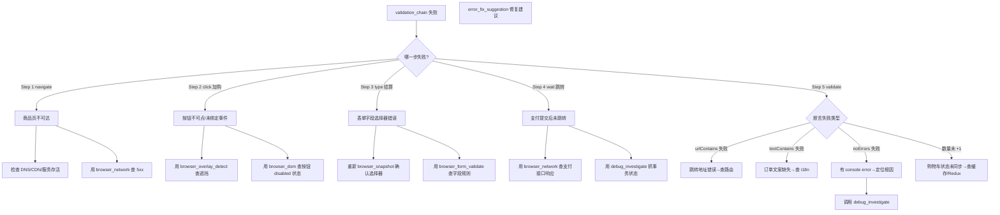

# 场景 Playbook: 电商下单全链路

> 场景：电商核心交易链路端到端验证——用户登录 → 浏览商品 → 加入购物车 → 结算 → 支付 → 订单确认。这是电商系统最关键的业务闭环，任何一环断裂都直接造成营收损失。

## 1. 场景背景与业务价值

电商下单链路是"营收生命线"。AI 生成的电商代码常出现：

- 登录成功但 session 未带上，加入购物车接口返回 401
- 商品详情页加载正常，但"加入购物车"按钮点击后无任何反馈（事件未绑定）
- 购物车数量更新了，但结算页读取的仍是旧数据（缓存未失效）
- 支付表单提交后跳转到错误页，订单却已创建（事务不一致）
- 订单确认页显示成功，但后端实际未扣减库存（库存与订单状态不一致）
- 单步功能都正常，但跨页面流程断裂，QA 手工回归耗时且易遗漏

**业务价值**：本 Playbook 用一次自动化运行覆盖完整下单链路，输出可追溯的证据链（截图 + trace + HAR + 报告），把"上线前人工回归 2 小时"压缩到"15 分钟自动验证"，且每次发版都能复跑。

**跨 Skill 编排**：本场景组合 3 个 Skill——[登录流程验证](../skills/login-validation)（登录环节）+ [表单提交验证](../skills/form-submission)（结算/支付表单）+ [端到端流程](../skills/e2e-flow)（整链路串联与证据收集）。

## 2. 验证目标（明确通过标准）

| 编号 | 通过标准 | 验证方式 |
|---|---|---|
| G1 | 登录成功跳转到商品列表页，URL 含 `/inventory` | `browser_assert.urlContains` |
| G2 | "加入购物车"后购物车角标数字 +1 | `browser_assert.textContains` + 数量对比 |
| G3 | 结算表单必填字段（姓名/邮编/地址）校验生效 | 空提交被拦截 + `browser_form_validate` |
| G4 | 支付提交后跳转到订单确认页，显示 "Thank you" | `browser_assert.urlContains` + `textContains` |
| G5 | 全流程无 console error、无 4xx/5xx 网络错误 | `validation_chain` 的 `noErrors: true` |
| G6 | 5 步链路全部通过（navigate/click/type/wait/validate） | `validation_chain.requiredSteps: true` |
| G7 | 证据链完整（每关键步有截图 + 最终 trace + HAR + 报告） | `evidence_pack` + `validation_report` |

**真实示例站点**：以 [saucedemo.com](https://www.saucedemo.com/)（Sauce Labs 公开电商 demo）作为演示目标。标准账号 `standard_user` / 密码 `secret_sauce`。

## 3. 跨 Skill 工具链编排

```
┌──────────────────────────────────────────────────────────────────┐
│  电商下单全链路 Playbook                                          │
├──────────────────────────────────────────────────────────────────┤
│                                                                  │
│  【Skill: 登录流程验证】                                          │
│  Step 1: browser_open         打开登录页                          │
│  Step 2: browser_snapshot     识别登录表单结构                    │
│  Step 3: browser_form_fill    填充用户名/密码                     │
│  Step 4: browser_click        点击登录按钮                        │
│  Step 5: browser_assert       断言跳转到商品列表（G1）            │
│     ↓                                                             │
│  【Skill: 表单提交验证 + 端到端流程】                              │
│  Step 6: validation_chain     下单链路 5 步闭合验证：             │
│            navigate(商品页) → click(加入购物车)                   │
│            → type(结算信息) → wait(订单页) → validate(G2/G4)      │
│     ↓                                                             │
│  【Skill: 端到端流程 - 证据与报告】                                │
│  Step 7: evidence_pack        收集关键步证据（截图/DOM/网络）      │
│  Step 8: validation_report    生成六段式 Markdown 报告            │
│                                                                  │
└──────────────────────────────────────────────────────────────────┘
```

**Skill 引用映射**：

| 步骤 | 来源 Skill | 文档 |
|---|---|---|
| Step 1-5 | 登录流程验证 | [login-validation.md](../skills/login-validation) |
| Step 6（click/type 部分） | 表单提交验证 | [form-submission.md](../skills/form-submission) |
| Step 6（链路闭合） | 端到端流程 - 工具链 A | [e2e-flow.md](../skills/e2e-flow) |
| Step 7-8 | 端到端流程 - 证据/报告 | [e2e-flow.md](../skills/e2e-flow) |

## 4. 分步执行脚本

以 [saucedemo.com](https://www.saucedemo.com/) 为例。

### Step 1: 打开登录页

```
browser_open({ url: 'https://www.saucedemo.com/' })
```

**预期结果**：页面加载完成，URL 为 `https://www.saucedemo.com/`，可见登录表单。

### Step 2: 截取快照，识别表单结构

```
browser_snapshot()
```

**预期结果**：返回页面结构，确认存在 `#user-name`、`#password`、`#login-button` 三个元素。

### Step 3: 填充登录表单（不自动提交）

```
browser_form_fill({
  fields: [
    { selector: '#user-name', value: 'standard_user' },
    { selector: '#password', value: 'secret_sauce' }
  ],
  submit: false
})
```

**预期结果**：`fieldsFilled: 2`，两个字段被正确填充。

### Step 4: 点击登录按钮

```
browser_click({ selector: '#login-button' })
```

**预期结果**：`ok: true`，触发跳转。

### Step 5: 断言登录成功（验证目标 G1）

```
browser_assert({
  urlContains: 'inventory',
  selectorVisible: '.inventory_list',
  noErrors: true
})
```

**预期结果**：`passed: true`，URL 变为 `https://www.saucedemo.com/inventory.html`，商品列表可见，无 console 错误。

### Step 6: 下单链路 5 步闭合验证（验证目标 G2/G3/G4/G5/G6）

```
validation_chain({
  steps: [
    { 'type': 'navigate', 'url': 'https://www.saucedemo.com/inventory.html' },
    { 'type': 'click', 'selector': 'button[data-test="add-to-cart-sauce-labs-backpack"]' },
    { 'type': 'type', 'selector': '#first-name', 'value': 'Tom' },
    { 'type': 'wait', 'urlContains': 'checkout-complete' },
    { 'type': 'validate', 'assertions': {
        'urlContains': 'checkout-complete',
        'textContains': 'Thank you for your order',
        'noErrors': true
      }
    }
  ],
  requiredSteps: true,
  failOnError: true,
  captureScreenshots: true,
  timeout: 60000
})
```

> 说明：`type` 步骤实际场景中需要在结算页填入姓名/邮编/地址。完整脚本应在 click 与 type 之间增加 `navigate` 到购物车页与结算页。本示例为突出 5 步闭合结构做了简化，真实执行时建议用 `validation_run` 跑多用例版本（见第 6 节扩展）。

**预期结果**：

```json
{
  "ok": true,
  "totalSteps": 5,
  "passedSteps": 5,
  "failedSteps": 0,
  "steps": [
    { "step": 1, "type": "navigate", "ok": true },
    { "step": 2, "type": "click", "ok": true, "selector": "button[data-test='add-to-cart-sauce-labs-backpack']" },
    { "step": 3, "type": "type", "ok": true, "selector": "#first-name" },
    { "step": 4, "type": "wait", "ok": true, "finalUrl": "https://www.saucedemo.com/checkout-complete.html" },
    { "step": 5, "type": "validate", "passed": true }
  ],
  "errors": [],
  "networkErrors": [],
  "duration": 8200
}
```

### Step 7: 收集证据（验证目标 G7）

```
evidence_pack({
  stepId: 'ecommerce-checkout-complete',
  label: '电商下单全链路完成',
  captureStep: true,
  screenshot: true,
  snapshot: true,
  har: true,
  autoAnalyze: true
})
```

**预期结果**：返回证据文件路径列表，包含截图、DOM 快照、HAR、trace。

### Step 8: 生成六段式报告

```
validation_report({ format: 'markdown', strictSchema: true })
```

**预期结果**：返回六段式 Markdown 报告（摘要 / 工具链 / 发现问题 / 网络证据 / 证据产物 / 待分类项）。

## 5. 预期产出

### 报告与证据文件清单

| 类型 | 路径 | 用途 |
|---|---|---|
| Markdown 报告 | `reports/ecommerce-checkout-<run-id>.md` | CI 解析、PR 评论 |
| HTML 报告 | `reports/ecommerce-checkout-<run-id>.html` | 上线审批存档（`validation_report_export` 生成） |
| 操作 trace | `traces/ecommerce-checkout-<run-id>.zip` | 失败复盘 |
| 网络 HAR | `traces/ecommerce-checkout-<run-id>.har` | 接口契约存档（⚠️ 上线前脱敏） |
| 关键步截图 | `screenshots/checkout-complete.png` 等 | 订单确认页留证 |
| 单步证据包 | `evidence/ecommerce-checkout-complete.evidence.json` | 结构化证据 |

### validation_chain 输出关键字段

- `ok: true` — 整体通过
- `passedSteps / totalSteps` — 步骤通过率
- `errors / networkErrors` — 必须为空数组
- `duration` — 全链路耗时（用于性能基线对比）

## 6. 失败处理决策树



### 常见失败与处置

| 失败现象 | 根因 | 处置 |
|---|---|---|
| Step 1 `net::ERR_CONNECTION_REFUSED` | 服务未启动 / 端口错误 | 部署验证，确认服务存活后重跑 |
| Step 2 `element not clickable` | 遮挡层 / 按钮 disabled | `browser_overlay_dismiss` 关闭遮挡；或检查库存为 0 时按钮是否应 disabled |
| Step 4 `wait timeout` | 支付接口 500 / 事务回滚 | `browser_network` 查 `/checkout` 接口响应体；`debug_investigate` 深挖 |
| Step 5 `noErrors: false` | 前端有未捕获异常 | `browser_errors` 拿错误堆栈；`error_fix_suggestion` 生成修复建议 |
| 购物车角标未更新 | 接口成功但前端状态未刷新 | 在 click 后插入 `browser_wait({ selector: '.shopping_cart_badge' })` 等状态更新 |

### 扩展：多用例回归版本（推荐上线前使用）

单链路 `validation_chain` 适合快速验证；上线前建议升级为 `validation_run` 多用例版本，覆盖正反两条路径：

```
validation_run({
  name: 'ecommerce-checkout-regression',
  cases: [
    {
      'name': 'happy-path-standard-user',
      'flow': [
        { 'type': 'navigate', 'url': 'https://www.saucedemo.com/' },
        { 'type': 'type', 'selector': '#user-name', 'value': 'standard_user' },
        { 'type': 'type', 'selector': '#password', 'value': 'secret_sauce' },
        { 'type': 'click', 'selector': '#login-button' },
        { 'type': 'wait', 'urlContains': 'inventory' },
        { 'type': 'validate', 'assertions': { 'urlContains': 'inventory', 'noErrors': true } }
      ]
    },
    {
      'name': 'locked-user-rejected',
      'flow': [
        { 'type': 'navigate', 'url': 'https://www.saucedemo.com/' },
        { 'type': 'type', 'selector': '#user-name', 'value': 'locked_out_user' },
        { 'type': 'type', 'selector': '#password', 'value': 'secret_sauce' },
        { 'type': 'click', 'selector': '#login-button' },
        { 'type': 'validate', 'assertions': { 'textContains': 'locked out', 'urlContains': '/' } }
      ]
    }
  ],
  clearErrors: true,
  trace: true,
  har: true,
  investigateOnFailure: true,
  continueOnFailure: true
})
```

## 7. 上线门禁建议

### 通过条件（全部满足方可放行）

| 门禁项 | 阈值 |
|---|---|
| `validation_chain.ok` | `true` |
| `passedSteps / totalSteps` | `5/5`（100%） |
| `errors` 数组长度 | `0` |
| `networkErrors` 数组长度 | `0`（无 4xx/5xx） |
| 关键断言 G1/G2/G4 | 全部 `pass: true` |
| 证据完整性 | 截图 + trace + HAR + 报告 4 件齐全 |
| 多用例版本（如启用） | `failedCases: 0` |

### 阻断条件（命中任一即阻断上线）

- `validation_chain.ok: false`（任一关键步失败）
- 支付相关接口（`/checkout`）返回 5xx
- 订单确认页未出现 "Thank you" 文案
- 购物车数量与加购操作不一致（库存与状态不一致风险）
- console 出现 `Uncaught Error` 级别异常
- trace 缺失导致无法复盘

### 软警告（不阻断但需登记）

- `duration` 较上次回归增长 > 30%（性能退化，转 [性能审计 Skill](../skills/performance-audit)）
- HAR 中慢请求 > 1s（建议优化，不阻断）
- 仅 `optimization` 级别问题（如文案拼写、非关键 a11y 提示）

## 相关文档

- [Skill: 登录流程验证](../skills/login-validation) — 本场景登录环节
- [Skill: 表单提交验证](../skills/form-submission) — 本场景结算/支付表单
- [Skill: 端到端流程](../skills/e2e-flow) — 本场景链路串联与报告
- [Skill: 调试排查](../skills/debug-investigation) — 失败时深入排查
- [场景: 部署后回归验证](./regression-after-deploy) — 下单链路作为部署后回归核心用例
