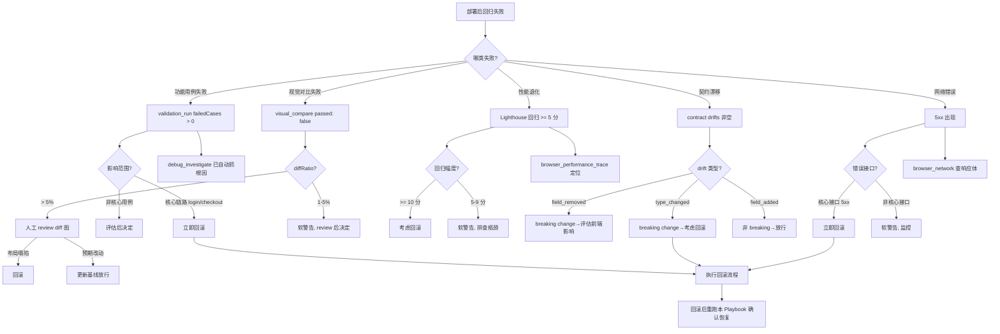

# 场景 Playbook: 部署后回归验证

> 场景：生产环境部署后立即执行的回归验证——核心业务流程功能回归 + UI 视觉对比 + 性能基线对比。这是"部署后、放量前"的最后一道防线，目标是 5 分钟内给出"可放量 / 需回滚"的决策依据，避免故障版本触达全量用户。

## 1. 场景背景与业务价值

部署后回归是"故障快速发现的金丝雀"。AI 生成或人工合并的代码常在部署后暴露：

- 核心流程功能回归（登录、下单、支付）断裂，但监控告警延迟 5-10 分钟才触发
- UI 视觉意外变化（按钮错位、布局塌陷），功能测试通过但视觉已坏
- 性能退化（LCP 从 2s 涨到 5s），无基线对比难以发现
- 部署后新版本接口契约漂移（字段缺失/类型变化），前端隐性故障
- 回滚决策缺乏数据支撑，靠"人工点点看"判断，既慢又不可靠

**业务价值**：本 Playbook 在部署后 5-10 分钟内自动执行：①核心业务流程 E2E 回归 ②关键页视觉对比 ③性能基线对比，输出"放行/回滚"决策报告，把"故障发现时间（MTTD）从 10 分钟压缩到 5 分钟"，避免坏版本放量。

**跨 Skill 编排**：本场景组合 3 个 Skill——[端到端流程](../skills/e2e-flow)（核心流程多用例回归）+ [视觉回归](../skills/visual-regression)（部署前后视觉对比）+ [性能审计](../skills/performance-audit)（性能基线对比）。

## 2. 验证目标（明确通过标准）

| 编号 | 通过标准 | 验证方式 |
|---|---|---|
| G1 | 核心业务流程多用例全部通过（登录/下单/支付等关键路径） | `validation_run` 的 `failedCases: 0` |
| G2 | 关键页视觉对比 `diffRatio ≤ maxDiffPixelRatio`（无意外视觉变化） | `browser_visual_compare.passed: true` |
| G3 | 性能评分较基线回归 < 5 分 | `browser_lighthouse_audit` 对比基线 |
| G4 | Core Web Vitals 无 `poor` 评级 | `browser_lighthouse_audit.metrics` |
| G5 | 全流程无 5xx 网络错误 | `validation_run` 的 `noErrors` |
| G6 | 接口契约无 breaking change（字段未缺失/类型未变） | `contract_guard` + `contract_baseline.compare` |
| G7 | 产出可决策的 HTML 报告（放行/回滚依据） | `validation_report_export` |

**真实示例站点**：以模拟生产站点 `https://app.example.com` 为部署后回归目标。核心流程用例参考 [电商下单全链路](./ecommerce-checkout) 场景；视觉基线在部署前已建立（基线版本 `v1.9.3-baseline`）。

## 3. 跨 Skill 工具链编排

```
┌──────────────────────────────────────────────────────────────────┐
│  部署后回归验证 Playbook                                          │
├──────────────────────────────────────────────────────────────────┤
│                                                                  │
│  【部署前一次性准备】                                             │
│  Step 0a: browser_visual_baseline  建立关键页视觉基线            │
│  Step 0b: contract_baseline.save    保存接口契约基线             │
│  Step 0c: browser_lighthouse_audit  记录性能基线评分             │
│  ============ 部署发生 ============                               │
│                                                                  │
│  【Skill: 端到端流程 - 核心业务回归】                              │
│  Step 1: validation_run          核心流程多用例回归（G1/G5）     │
│            ① 登录链路  ② 下单链路  ③ 支付链路                   │
│            失败时自动 debug_investigate                          │
│     ↓                                                             │
│  【Skill: 视觉回归 - 关键页视觉对比】                              │
│  Step 2: browser_visual_compare  关键页对比基线（G2）            │
│            ① 首页  ② 商品页  ③ 订单确认页                       │
│     ↓                                                             │
│  【Skill: 性能审计 - 性能基线对比】                                │
│  Step 3: browser_lighthouse_audit 性能审计 + 基线对比（G3/G4）   │
│     ↓                                                             │
│  【契约守护 - 接口漂移检测】                                       │
│  Step 4: contract_guard +         接口契约对比基线（G6）         │
│          contract_baseline.compare                               │
│     ↓                                                             │
│  Step 5: evidence_pack            收集回归证据                   │
│  Step 6: validation_report        生成回归报告                   │
│  Step 7: validation_report_export 导出 HTML 决策报告（G7）       │
│                                                                  │
└──────────────────────────────────────────────────────────────────┘
```

**Skill 引用映射**：

| 步骤 | 来源 Skill | 文档 |
|---|---|---|
| Step 1 | 端到端流程 - 工具链 B（多用例） | [e2e-flow.md](../skills/e2e-flow) |
| Step 2 | 视觉回归 - 工具链 A（全页对比） | [visual-regression.md](../skills/visual-regression) |
| Step 3 | 性能审计 | [performance-audit.md](../skills/performance-audit) |
| Step 4 | 验证框架 - 契约守护 | [validation.md](../tools/validation) |
| Step 5-7 | 端到端流程 - 证据/报告 | [e2e-flow.md](../skills/e2e-flow) |

## 4. 分步执行脚本

### Step 0a（部署前一次性）: 建立视觉基线

```
browser_open({ url: 'https://app.example.com' })
browser_visual_baseline({
  name: 'home-v1.9.3-baseline',
  fullPage: true,
  maskSelectors: ['.ad-banner', '.timestamp', '.user-avatar']
})

browser_open({ url: 'https://app.example.com/products' })
browser_visual_baseline({
  name: 'products-v1.9.3-baseline',
  fullPage: true,
  maskSelectors: ['.ad-banner', '.price-tag']
})
```

> 说明：基线按版本命名，避免新旧混淆。`maskSelectors` 遮挡动态区域（广告/时间戳/头像）消除噪声。

### Step 0b（部署前）: 保存接口契约基线

```
contract_guard({
  fromNetwork: true,
  autoDiscover: true,
  urlContains: '/api/'
})
contract_baseline({ action: 'save', name: 'v1.9.3-api-contract' })
```

### Step 0c（部署前）: 记录性能基线

```
browser_lighthouse_audit({
  url: 'https://app.example.com',
  categories: ['performance'],
  formFactor: 'mobile',
  throttling: true
})
# 记录 scores.performance = 92 作为基线
```

### ============ 部署发生 ============

### Step 1: 核心业务流程多用例回归（验证目标 G1/G5）

```
validation_run({
  name: 'post-deploy-regression',
  cases: [
    {
      'name': 'login-flow',
      'flow': [
        { 'type': 'navigate', 'url': 'https://app.example.com/login' },
        { 'type': 'type', 'selector': '#email', 'value': 'user@example.com' },
        { 'type': 'type', 'selector': '#password', 'value': 'UserP@ss!2026' },
        { 'type': 'click', 'selector': "button[type='submit']" },
        { 'type': 'wait', 'urlContains': 'dashboard' },
        { 'type': 'validate', 'assertions': { 'urlContains': 'dashboard', 'noErrors': true } }
      ]
    },
    {
      'name': 'add-to-cart-flow',
      'flow': [
        { 'type': 'navigate', 'url': 'https://app.example.com/products' },
        { 'type': 'click', 'selector': '.btn-add-to-cart:first-child' },
        { 'type': 'wait', 'selectorVisible': '.cart-badge' },
        { 'type': 'validate', 'assertions': { 'selectorVisible': '.cart-badge', 'noErrors': true } }
      ]
    },
    {
      'name': 'checkout-flow',
      'flow': [
        { 'type': 'navigate', 'url': 'https://app.example.com/cart' },
        { 'type': 'click', 'selector': '.btn-checkout' },
        { 'type': 'wait', 'urlContains': 'checkout' },
        { 'type': 'validate', 'assertions': { 'urlContains': 'checkout', 'noErrors': true } }
      ]
    }
  ],
  clearErrors: true,
  instrument: true,
  trace: true,
  har: true,
  investigateOnFailure: true,
  continueOnFailure: true
})
```

**预期结果**：

```json
{
  "ok": true,
  "runId": "run-20260718-postdeploy",
  "name": "post-deploy-regression",
  "totalCases": 3,
  "passedCases": 3,
  "failedCases": 0,
  "cases": [
    { "name": "login-flow", "passed": true, "duration": 3200 },
    { "name": "add-to-cart-flow", "passed": true, "duration": 2800 },
    { "name": "checkout-flow", "passed": true, "duration": 4100 }
  ],
  "tracePath": "traces/run-20260718-postdeploy.zip",
  "harPath": "traces/run-20260718-postdeploy.har"
}
```

若任一用例失败，`investigateOnFailure` 会自动调用 `debug_investigate` 抓取根因。

### Step 2: 关键页视觉对比（验证目标 G2）

```
# 首页对比
browser_open({ url: 'https://app.example.com' })
browser_visual_compare({
  name: 'home-v1.9.3-baseline',
  fullPage: true,
  maskSelectors: ['.ad-banner', '.timestamp', '.user-avatar'],
  maxDiffPixelRatio: 0.01
})

# 商品页对比
browser_open({ url: 'https://app.example.com/products' })
browser_visual_compare({
  name: 'products-v1.9.3-baseline',
  fullPage: true,
  maskSelectors: ['.ad-banner', '.price-tag'],
  maxDiffPixelRatio: 0.01
})
```

**预期结果**：

```json
{
  "ok": true,
  "name": "home-v1.9.3-baseline",
  "diffPixels": 152,
  "diffRatio": 0.003,
  "passed": true,
  "threshold": 0.01
}
```

`passed: true` 表示视觉无显著变化。若 `passed: false`，需人工 review `diffPath` 差异图。

### Step 3: 性能基线对比（验证目标 G3/G4）

```
browser_lighthouse_audit({
  url: 'https://app.example.com',
  categories: ['performance'],
  formFactor: 'mobile',
  throttling: true
})
```

**预期结果**：

```json
{
  "ok": true,
  "scores": { "performance": 90 },
  "metrics": {
    "lcp": 2300,
    "cls": 0.08,
    "fid": 95,
    "tbt": 180
  }
}
```

**基线对比**：基线 `performance: 92`，本次 `90`，回归 2 分（< 5 分阈值，软警告通过）。Core Web Vitals 三件套均为 `good`。

### Step 4: 接口契约漂移检测（验证目标 G6）

```
# 重新采集契约
contract_guard({
  fromNetwork: true,
  autoDiscover: true,
  urlContains: '/api/'
})

# 与基线对比
contract_baseline({ action: 'compare', name: 'v1.9.3-api-contract' })
```

**预期结果**：

```json
{
  "success": true,
  "drifts": [],
  "summary": {
    "endpoint_added": 0,
    "endpoint_removed": 0,
    "field_modified": 0,
    "type_changed": 0
  }
}
```

`drifts: []` 表示无 breaking change。若出现 `field_removed` 或 `type_changed`，需评估前端影响。

### Step 5: 收集回归证据

```
evidence_pack({
  stepId: 'post-deploy-regression-complete',
  label: '部署后回归验证完成',
  captureStep: true,
  screenshot: true,
  snapshot: true,
  har: true,
  autoAnalyze: true
})
```

### Step 6: 生成回归报告

```
validation_report({ format: 'markdown', strictSchema: true })
```

### Step 7: 导出 HTML 决策报告（验证目标 G7）

```
validation_report_export()
```

**预期结果**：返回 HTML 报告本地路径，可作为放行/回滚决策依据存档。

## 5. 预期产出

### 报告与证据文件清单

| 类型 | 路径 | 用途 |
|---|---|---|
| Markdown 回归报告 | `reports/post-deploy-<run-id>.md` | CI 解析、自动评论 PR |
| HTML 决策报告 | `reports/post-deploy-<run-id>.html` | **放行/回滚决策依据** |
| 回归 trace | `traces/post-deploy-<run-id>.zip` | 失败用例复盘 |
| 网络 HAR | `traces/post-deploy-<run-id>.har` | 接口响应存档 |
| 视觉对比图 | `visual/diffs/home-v1.9.3-baseline-diff.png` | 视觉差异可视化 |
| Lighthouse 报告 | `reports/lighthouse-post-deploy.html` | 性能评分详情 |
| 契约对比报告 | `reports/contract-drift-v1.9.3.json` | 接口漂移详情 |

### 回归决策摘要卡（报告核心）

| 维度 | 检查项 | 基线 | 实际 | 回归 | 决策 |
|---|---|---|---|---|---|
| 功能 | 核心流程通过率 | 3/3 | 3/3 | 0 | ✅ 放行 |
| 视觉 | 首页 diffRatio | 0 | 0.003 | < 1% | ✅ 放行 |
| 视觉 | 商品页 diffRatio | 0 | 0.005 | < 1% | ✅ 放行 |
| 性能 | Lighthouse 评分 | 92 | 90 | -2 | ✅ 放行（< 5） |
| 性能 | LCP | 2100ms | 2300ms | +200ms | ✅ good |
| 契约 | API breaking change | 0 | 0 | 0 | ✅ 放行 |
| 网络 | 5xx 错误 | 0 | 0 | 0 | ✅ 放行 |

### 关键输出字段解读

- `validation_run.failedCases` — 必须为 `0`（任一核心流程失败即考虑回滚）
- `browser_visual_compare.passed` — 必须为 `true`
- Lighthouse 回归分 = 基线分 - 本次分，< 5 分放行，≥ 5 分软警告，≥ 10 分考虑回滚
- `contract_baseline.compare.drifts` — `field_removed` / `type_changed` 需评估影响

## 6. 失败处理决策树



### 常见失败与处置

| 失败现象 | 根因 | 处置 |
|---|---|---|
| `validation_run` login-flow 失败 | 登录接口 500 / session 配置变更 | 立即回滚；`debug_investigate` 抓后端日志 |
| `validation_run` checkout-flow 失败 | 支付接口变更 / 路由配置错 | 立即回滚（核心营收链路） |
| `visual_compare` diffRatio > 5% | CSS 改动意外影响布局 | review diff 图；布局塌陷则回滚，预期改动则更新基线 |
| Lighthouse 回归 ≥ 10 分 | 新增大资源 / 未压缩图片 | 考虑回滚；用 `browser_performance_trace` 定位瓶颈 |
| LCP 从 good 退到 poor | 首屏资源变更 | 回滚或紧急优化 |
| `contract_baseline.compare` 出现 `type_changed` | 后端接口字段类型变更 | breaking change，评估前端影响后决定 |
| 5xx 接口错误 | 部署不完整 / 配置缺失 | 立即回滚；查部署日志 |
| 视觉基线过时 | 业务迭代后基线已不适用 | 更新基线（`browser_visual_baseline` 同名覆盖）后重跑 |

### 扩展：自动化回滚触发（CI 集成）

在 CI 中将本 Playbook 的退出码与回滚钩子绑定：

```yaml
# 伪代码 - CI 配置示例
post-deploy-regression:
  script:
    - ai-verify run --playbook regression-after-deploy --url https://app.example.com
  after_failure:
    - rollback-to-previous-version
    - notify-oncall-slack
```

关键门禁（命中即自动回滚）：
- `validation_run.failedCases > 0` 且失败用例为核心链路
- Lighthouse 回归 ≥ 10 分
- 核心接口 5xx

## 7. 上线门禁建议

### 通过条件（全部满足方可放量）

| 门禁项 | 阈值 |
|---|---|
| `validation_run.failedCases` | `0`（核心流程全通过） |
| `browser_visual_compare.passed` | `true`（所有关键页） |
| Lighthouse 回归分 | < 5 分 |
| Core Web Vitals | 无 `poor` 评级 |
| `contract_baseline.compare.drifts` | 无 `field_removed` / `type_changed` |
| 5xx 网络错误 | `0` |
| HTML 决策报告 | 已生成并存档 |

### 阻断条件（命中任一即触发回滚）

- 核心业务流程（login / checkout / payment）任一用例失败
- 视觉对比显示布局塌陷（diffRatio > 5% 且非预期改动）
- Lighthouse 回归 ≥ 10 分
- LCP 退到 `poor`（> 4000ms）
- 接口契约出现 `field_removed` 或 `type_changed`（breaking change）
- 核心接口出现 5xx

### 软警告（不阻断但需登记 + 监控）

- 非核心用例失败（如次要页面功能）
- Lighthouse 回归 5-9 分（排查但不回滚）
- 视觉 diffRatio 1-5%（人工 review 后决定）
- 契约出现 `field_added`（非 breaking，前端兼容）
- 慢请求 > 1s 但无 5xx（性能监控）

### 放量策略建议

| 回归结果 | 放量策略 |
|---|---|
| 全部通过 + 无软警告 | 全量放量 |
| 全部通过 + 有软警告 | 灰度 10% → 50% → 100%，每阶段监控 |
| 命中阻断条件 | 立即回滚，修复后重跑本 Playbook |
| 命中软警告但非阻断 | 灰度 10% 观察 30 分钟，无恶化再放量 |

## 相关文档

- [Skill: 端到端流程](../skills/e2e-flow) — 本场景核心流程多用例回归
- [Skill: 视觉回归](../skills/visual-regression) — 本场景视觉基线对比
- [Skill: 性能审计](../skills/performance-audit) — 本场景性能基线对比
- [Skill: 调试排查](../skills/debug-investigation) — 回归失败时根因分析
- [场景: 电商下单全链路](./ecommerce-checkout) — 部署后回归的核心用例来源
- [场景: SEO+性能+A11y 审计](./seo-lighthouse) — 性能基线建立的详细方法
