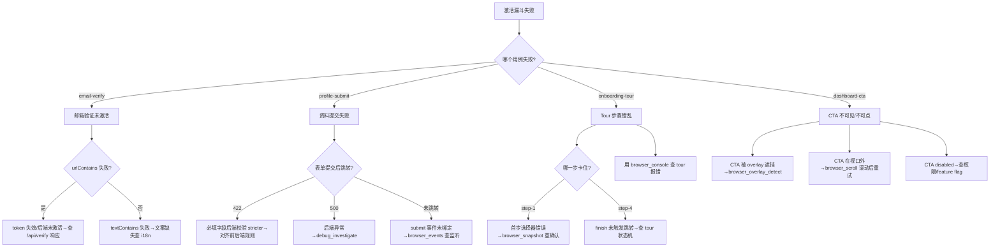

# 场景 Playbook: SaaS 注册引导流程

> 场景：SaaS 产品新用户激活全链路验证——注册账号 → 邮箱验证 → 完善资料 → 首次引导（Onboarding Tour）→ 价值体验（Aha Moment）。这是 SaaS 漏斗最关键的"注册→激活"转化环节，每一步流失都直接拉低 DAU 与付费转化。

## 1. 场景背景与业务价值

SaaS 注册引导流程是"增长引擎的第一道关卡"。AI 生成的注册/引导代码常出现：

- 注册表单字段校验缺失（邮箱格式、密码强度未校验，脏数据入库）
- 提交注册后无 loading 状态、无成功反馈，用户重复点击导致重复创建账号
- 邮箱验证链接点击后未自动激活，用户卡在"待验证"状态
- 完善资料表单的必填字段在前端未拦截，后端 422 但前端无提示
- Onboarding Tour 步骤跳转错乱（点"下一步"跳到非预期页面）
- 价值体验页（Dashboard 首屏）关键 CTA 不可见或不可点
- 各步之间状态丢失（注册成功但进入引导时 session 失效）

**业务价值**：本 Playbook 用一次自动化运行覆盖完整激活漏斗，定位"注册到激活"的流失点，输出每步证据，把"产品经理人工走查 1 小时"压缩到"10 分钟自动验证"。

**跨 Skill 编排**：本场景组合 2 个 Skill——[表单提交验证](../skills/form-submission)（注册/资料表单环节）+ [端到端流程](../skills/e2e-flow)（整漏斗串联与多用例验收）。

## 2. 验证目标（明确通过标准）

| 编号 | 通过标准 | 验证方式 |
|---|---|---|
| G1 | 注册表单必填字段（邮箱/密码）校验生效，空提交被拦截 | `browser_form_validate.checkRequired: true` |
| G2 | 邮箱格式错误时前端拦截（输入 `invalid-email` 不通过） | `browser_form_validate.checkPattern: true` |
| G3 | 密码强度校验生效（< 8 位被拦截） | `browser_form_validate.checkLength: true` |
| G4 | 合法注册提交后跳转到"邮箱验证"提示页 | `browser_assert.urlContains` + `textContains` |
| G5 | 邮箱验证链接点击后状态变为"已激活"，跳转完善资料页 | `browser_assert.urlContains: 'profile'` |
| G6 | Onboarding Tour 4 步全部可走完，每步 CTA 可点击 | `validation_run` 多用例 |
| G7 | 进入 Dashboard 首屏，关键 CTA（如"创建项目"）可见可点 | `browser_assert.selectorVisible` |
| G8 | 全流程无 console error、无 5xx | `validation_run` 的 `noErrors` |

**真实示例站点**：以模拟 SaaS 站点 `https://app.example.com` 为演示目标（注册页 `/signup`、验证页 `/verify`、资料页 `/profile`、引导页 `/onboarding`、Dashboard `/dashboard`）。表单校验部分以公开站点 [the-internet.herokuapp.com/login](https://the-internet.herokuapp.com/login) 作为可执行演示。

## 3. 跨 Skill 工具链编排

```
┌──────────────────────────────────────────────────────────────────┐
│  SaaS 注册引导流程 Playbook                                       │
├──────────────────────────────────────────────────────────────────┤
│                                                                  │
│  【Skill: 表单提交验证 - 注册表单规则检测】                        │
│  Step 1: browser_open           打开注册页                        │
│  Step 2: browser_snapshot       识别注册表单结构                  │
│  Step 3: browser_form_validate  检测必填/格式/长度规则（G1/G2/G3）│
│     ↓                                                             │
│  【Skill: 表单提交验证 - 合法注册提交】                            │
│  Step 4: browser_form_fill      填充合法邮箱/密码（不自动提交）   │
│  Step 5: browser_click          点击注册按钮                      │
│  Step 6: browser_assert         断言跳转邮箱验证页（G4）          │
│     ↓                                                             │
│  【Skill: 端到端流程 - 激活漏斗多用例验收】                        │
│  Step 7: validation_run         漏斗多用例：                      │
│            ① 邮箱验证激活（G5）                                   │
│            ② 完善资料提交（G6 前置）                              │
│            ③ Onboarding Tour 4 步走完（G6）                      │
│            ④ Dashboard CTA 可见可点（G7）                         │
│     ↓                                                             │
│  Step 8: evidence_pack          收集漏斗各步证据                  │
│  Step 9: validation_report      生成激活漏斗报告                  │
│                                                                  │
└──────────────────────────────────────────────────────────────────┘
```

**Skill 引用映射**：

| 步骤 | 来源 Skill | 文档 |
|---|---|---|
| Step 1-3 | 表单提交验证 - 规则检测 | [form-submission.md](../skills/form-submission) |
| Step 4-6 | 表单提交验证 - 提交反馈 | [form-submission.md](../skills/form-submission) |
| Step 7 | 端到端流程 - 工具链 B（多用例） | [e2e-flow.md](../skills/e2e-flow) |
| Step 8-9 | 端到端流程 - 证据/报告 | [e2e-flow.md](../skills/e2e-flow) |

## 4. 分步执行脚本

### Step 1: 打开注册页

```
browser_open({ url: 'https://app.example.com/signup' })
```

**预期结果**：页面加载完成，可见注册表单（邮箱 + 密码 + 注册按钮）。

### Step 2: 截取快照，识别表单结构

```
browser_snapshot()
```

**预期结果**：返回页面结构，确认存在 `#email`、`#password`、`button[type='submit']` 等元素。

### Step 3: 检测注册表单验证规则（验证目标 G1/G2/G3）

```
browser_form_validate({
  url: 'https://app.example.com/signup',
  formSelector: 'form',
  checkRequired: true,
  checkPattern: true,
  checkLength: true
})
```

**预期结果**：

```json
{
  "ok": true,
  "formSelector": "form",
  "fields": [
    { "name": "email", "type": "email", "required": true, "pattern": "^[^@]+@[^@]+\\.[^@]+$" },
    { "name": "password", "type": "password", "required": true, "minLength": 8, "maxLength": 64 }
  ],
  "rules": { "requiredCount": 2, "patternCount": 1, "lengthCount": 1 },
  "issues": []
}
```

若 `issues` 非空（如 `missing pattern validation`），说明 AI 生成的表单漏了校验，需在门禁中标记。

### Step 4: 填充合法注册信息（不自动提交）

```
browser_form_fill({
  url: 'https://app.example.com/signup',
  fields: {
    '#email': 'newuser@example.com',
    '#password': 'Str0ngP@ss!2026'
  },
  submit: false
})
```

**预期结果**：`fieldsFilled: 2`，邮箱与密码被正确填充。

### Step 5: 点击注册按钮

```
browser_click({ selector: "button[type='submit']" })
```

**预期结果**：`ok: true`，触发注册请求与跳转。

### Step 6: 断言跳转到邮箱验证页（验证目标 G4）

```
browser_assert({
  urlContains: 'verify',
  textContains: 'verification email',
  noErrors: true,
  timeout: 10000
})
```

**预期结果**：`passed: true`，URL 变为 `https://app.example.com/verify`，页面显示"已发送验证邮件"提示。

### Step 7: 激活漏斗多用例验收（验证目标 G5/G6/G7/G8）

```
validation_run({
  name: 'saas-onboarding-funnel',
  cases: [
    {
      'name': 'email-verify-activates-account',
      'flow': [
        { 'type': 'navigate', 'url': 'https://app.example.com/verify?token=VALID_TOKEN' },
        { 'type': 'wait', 'urlContains': 'profile' },
        { 'type': 'validate', 'assertions': {
            'urlContains': 'profile',
            'textContains': 'activated',
            'noErrors': true
          }
        }
      ]
    },
    {
      'name': 'profile-completion-submit',
      'flow': [
        { 'type': 'navigate', 'url': 'https://app.example.com/profile' },
        { 'type': 'type', 'selector': '#full-name', 'value': 'Alice Lee' },
        { 'type': 'type', 'selector': '#company', 'value': 'Acme Inc' },
        { 'type': 'click', 'selector': "button[type='submit']" },
        { 'type': 'wait', 'urlContains': 'onboarding' },
        { 'type': 'validate', 'assertions': { 'urlContains': 'onboarding', 'noErrors': true } }
      ]
    },
    {
      'name': 'onboarding-tour-4-steps',
      'flow': [
        { 'type': 'navigate', 'url': 'https://app.example.com/onboarding' },
        { 'type': 'click', 'selector': '.tour-step-1 .tour-next' },
        { 'type': 'click', 'selector': '.tour-step-2 .tour-next' },
        { 'type': 'click', 'selector': '.tour-step-3 .tour-next' },
        { 'type': 'click', 'selector': '.tour-step-4 .tour-finish' },
        { 'type': 'wait', 'urlContains': 'dashboard' },
        { 'type': 'validate', 'assertions': { 'urlContains': 'dashboard', 'noErrors': true } }
      ]
    },
    {
      'name': 'dashboard-cta-visible-clickable',
      'flow': [
        { 'type': 'navigate', 'url': 'https://app.example.com/dashboard' },
        { 'type': 'validate', 'assertions': {
            'selectorVisible': '.cta-create-project',
            'noErrors': true
          }
        }
      ]
    }
  ],
  clearErrors: true,
  instrument: true,
  trace: true,
  har: true,
  investigateOnFailure: true,
  continueOnFailure: true
})
```

**预期结果**：

```json
{
  "ok": true,
  "runId": "run-20260718-160000",
  "name": "saas-onboarding-funnel",
  "totalCases": 4,
  "passedCases": 4,
  "failedCases": 0,
  "cases": [
    { "name": "email-verify-activates-account", "passed": true, "duration": 2100 },
    { "name": "profile-completion-submit", "passed": true, "duration": 2800 },
    { "name": "onboarding-tour-4-steps", "passed": true, "duration": 4500 },
    { "name": "dashboard-cta-visible-clickable", "passed": true, "duration": 1600 }
  ]
}
```

### Step 8: 收集漏斗证据

```
evidence_pack({
  stepId: 'saas-onboarding-funnel-complete',
  label: 'SaaS 激活漏斗完成',
  captureStep: true,
  screenshot: true,
  snapshot: true,
  har: true,
  autoAnalyze: true
})
```

### Step 9: 生成激活漏斗报告

```
validation_report({ format: 'markdown', strictSchema: true })
```

## 5. 预期产出

### 报告与证据文件清单

| 类型 | 路径 | 用途 |
|---|---|---|
| Markdown 报告 | `reports/saas-onboarding-<run-id>.md` | 漏斗分析、每步通过率 |
| HTML 报告 | `reports/saas-onboarding-<run-id>.html` | 上线审批存档 |
| 操作 trace | `traces/saas-onboarding-<run-id>.zip` | 失败步复盘 |
| 网络 HAR | `traces/saas-onboarding-<run-id>.har` | 注册/验证接口契约存档 |
| 各步截图 | `screenshots/signup.png`、`verify.png`、`dashboard.png` 等 | 漏斗各屏留证 |
| 表单规则报告 | `reports/form-rules-signup.md` | 表单校验规则检测结果 |

### 关键输出字段解读

- `browser_form_validate.issues` — 必须为空数组；非空说明表单校验有缺失
- `validation_run.passedCases / totalCases` — 漏斗通过率，`4/4` 为目标
- 每个用例的 `duration` — 各步耗时，用于定位"卡点"步骤（如验证链接激活慢）

## 6. 失败处理决策树



### 常见失败与处置

| 失败现象 | 根因 | 处置 |
|---|---|---|
| `browser_form_validate` 报 `missing pattern validation` | 邮箱字段未加 `type="email"` 或 pattern | 标记为门禁阻断，要求前端补校验 |
| Step 6 `textContains: 'verification email'` 失败 | i18n 文案缺失或 key 错误 | 查 locale 文件；用 `browser_dom` 看实际渲染文本 |
| `email-verify` 用例 `urlContains: 'profile'` 失败 | token 过期 / 后端激活逻辑 bug | `browser_network` 查 `/api/verify` 响应码与 body |
| `onboarding-tour` 中间步 click 超时 | Tour 动画未完成 / 选择器在动画后才出现 | 在 click 前插入 `browser_wait({ selectorVisible: '.tour-step-N .tour-next' })` |
| `dashboard-cta` `selectorVisible` 失败 | CTA 在折叠菜单内 / feature flag 关闭 | `browser_dom` 查 CTA 是否在 DOM；查 `localStorage` 的 feature flag |
| 用例间状态污染 | 用例 A 的 session 影响用例 B | 每用例开头 `navigate` 到干净态；或 `browser_cookies({ action: 'clear' })` |

### 扩展：反向用例（建议补充）

正向用例验证"能用"，反向用例验证"边界拦截"。建议在 `validation_run` 中追加：

```
{
  'name': 'invalid-email-rejected',
  'flow': [
    { 'type': 'navigate', 'url': 'https://app.example.com/signup' },
    { 'type': 'type', 'selector': '#email', 'value': 'invalid-email' },
    { 'type': 'click', 'selector': "button[type='submit']" },
    { 'type': 'validate', 'assertions': {
        'textContains': 'valid email',
        'urlContains': 'signup'
      }
    }
  ]
},
{
  'name': 'weak-password-rejected',
  'flow': [
    { 'type': 'navigate', 'url': 'https://app.example.com/signup' },
    { 'type': 'type', 'selector': '#email', 'value': 'user@example.com' },
    { 'type': 'type', 'selector': '#password', 'value': '123' },
    { 'type': 'click', 'selector': "button[type='submit']" },
    { 'type': 'validate', 'assertions': {
        'textContains': 'at least 8',
        'urlContains': 'signup'
      }
    }
  ]
}
```

## 7. 上线门禁建议

### 通过条件（全部满足方可放行）

| 门禁项 | 阈值 |
|---|---|
| `browser_form_validate.issues` | `[]`（无校验缺失） |
| 注册提交后跳转 | URL 含 `verify` |
| `validation_run.passedCases / totalCases` | `4/4`（正向漏斗全通过） |
| 反向用例（如启用） | 全部 `passed: true`（错误数据被拦截） |
| `noErrors` | 全流程无 console error |
| 证据完整性 | 截图 + trace + HAR + 报告 4 件齐全 |

### 阻断条件（命中任一即阻断上线）

- `browser_form_validate.issues` 非空（表单校验缺失是脏数据入库源头）
- 邮箱验证链接点击后未激活（核心激活路径断裂）
- Onboarding Tour 任一步骤无法点击完成（引导断裂导致用户流失）
- Dashboard 关键 CTA 不可见不可点（价值体验无法触达）
- 注册/验证接口返回 5xx

### 软警告（不阻断但需登记）

- 某步 `duration` 较基线增长 > 50%（可能是性能退化，转 [性能审计 Skill](../skills/performance-audit)）
- Onboarding Tour 文案仅有英文（i18n 覆盖不全，不阻断但影响国际化）
- 资料表单字段无 `autocomplete` 属性（体验优化项）

## 相关文档

- [Skill: 表单提交验证](../skills/form-submission) — 本场景注册/资料表单环节
- [Skill: 端到端流程](../skills/e2e-flow) — 本场景漏斗多用例串联
- [Skill: 登录流程验证](../skills/login-validation) — 注册后回访登录验证
- [Skill: 调试排查](../skills/debug-investigation) — 激活失败时深入排查
- [场景: 电商下单全链路](./ecommerce-checkout) — 同类端到端业务场景
