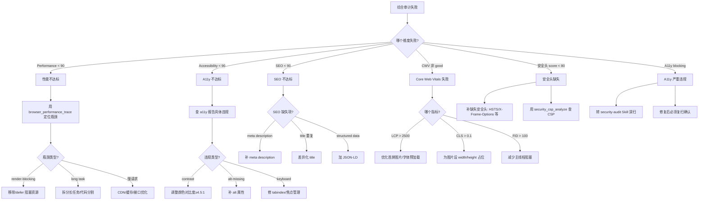

# 场景 Playbook: SEO + 性能 + 可访问性综合审计

> 场景：Web 站点上线前综合质量评估——SEO + 性能（Performance）+ 可访问性（A11y）+ 安全头四维度一次性审计。任何一维度不达标都会影响搜索排名、用户体验与合规性，是"上线前最后一道质量门"。

## 1. 场景背景与业务价值

上线前综合质量评估是"用户体验与合规的总闸"。AI 生成的站点常出现：

- Lighthouse 性能评分 < 70（红灯），LCP > 2.5s，移动端体验差
- SEO 评分低：缺失 meta description、title 重复、无 structured data
- A11y 不达标：图片缺 alt、对比度不足、键盘不可达（WCAG AA 不合规，面临 ADA 诉讼风险）
- HTTP 安全头缺失（无 HSTS、无 X-Frame-Options），被安全扫描标红
- CLS > 0.1（累积布局偏移），页面跳动严重
- 各维度独立检查耗时，且缺少可对比的基线

**业务价值**：本 Playbook 用一次自动化运行覆盖 Lighthouse 4 维度 + Core Web Vitals + A11y + 安全头，输出统一的质量报告与上线门禁判定，把"四类工程师各自评估 1 天"压缩到"20 分钟综合审计"。

**跨 Skill 编排**：本场景组合 3 个 Skill——[性能审计](../skills/performance-audit)（Lighthouse + CWV）+ [安全审计](../skills/security-audit)（HTTP 安全头）+ [视觉回归](../skills/visual-regression)（无基线 UI 问题扫描）。

## 2. 验证目标（明确通过标准）

| 编号 | 通过标准 | 验证方式 |
|---|---|---|
| G1 | Lighthouse Performance ≥ 90（绿灯） | `browser_lighthouse_audit.scores.performance` |
| G2 | Lighthouse Accessibility ≥ 90 | `browser_lighthouse_audit.scores.accessibility` |
| G3 | Lighthouse Best Practices ≥ 90 | `browser_lighthouse_audit.scores.bestPractices` |
| G4 | Lighthouse SEO ≥ 90 | `browser_lighthouse_audit.scores.seo` |
| G5 | Core Web Vitals 三件套全部 `good`（LCP ≤ 2500ms / CLS ≤ 0.1 / FID ≤ 100ms） | `browser_performance_check.coreWebVitals` |
| G6 | 所有性能预算通过 | `browser_performance_check.allBudgetsPassed: true` |
| G7 | A11y 无 `blocking` 级别问题（contrast / alt / keyboard） | `browser_a11y_check` |
| G8 | HTTP 安全头评分 ≥ 80（CSP / HSTS / X-Frame-Options 齐全） | `security_headers_check.score` |
| G9 | 无 `blocking` 级别 UI 问题（重叠 / 遮挡 / z-index） | `browser_visual_check` |

**真实示例站点**：以 [example.com](https://example.com/)（公开域名，仅作演示）作为审计目标。移动端优先用 `formFactor: "mobile"` + `throttling: true` 模拟真实 3G 场景。

## 3. 跨 Skill 工具链编排

```
┌──────────────────────────────────────────────────────────────────┐
│  SEO + 性能 + A11y 综合审计 Playbook                              │
├──────────────────────────────────────────────────────────────────┤
│                                                                  │
│  【Skill: 性能审计 - Lighthouse 4 维度】                           │
│  Step 1: browser_open              打开目标页                     │
│  Step 2: browser_lighthouse_audit  Performance/A11y/BP/SEO 评分  │
│                                   （G1/G2/G3/G4，mobile + 3G）    │
│     ↓                                                             │
│  【Skill: 性能审计 - Core Web Vitals + 预算】                      │
│  Step 3: browser_performance_check CWV 评级 + 预算对比            │
│                                   （G5/G6）                       │
│     ↓                                                             │
│  【Skill: 视觉回归 - 无基线 A11y/UI 扫描】                         │
│  Step 4: browser_a11y_check        A11y 深度扫描（G7）            │
│  Step 5: browser_visual_check      UI 问题扫描（G9，含 a11y）     │
│     ↓                                                             │
│  【Skill: 安全审计 - HTTP 安全头】                                 │
│  Step 6: security_headers_check    5 个安全头检查（G8）           │
│  Step 7: security_csp_analyze      CSP 深度分析                   │
│     ↓                                                             │
│  Step 8: evidence_pack             收集综合审计证据               │
│  Step 9: validation_report         生成综合质量报告               │
│                                                                  │
└──────────────────────────────────────────────────────────────────┘
```

**Skill 引用映射**：

| 步骤 | 来源 Skill | 文档 |
|---|---|---|
| Step 1-3 | 性能审计 | [performance-audit.md](../skills/performance-audit) |
| Step 4-5 | 视觉回归 - 工具链 C（无基线扫描） | [visual-regression.md](../skills/visual-regression) |
| Step 6-7 | 安全审计 - HTTP 头 + CSP | [security-audit.md](../skills/security-audit) |
| Step 8-9 | 端到端流程 - 证据/报告 | [e2e-flow.md](../skills/e2e-flow) |

## 4. 分步执行脚本

以 [example.com](https://example.com/) 为例。

### Step 1: 打开目标页

```
browser_open({ url: 'https://example.com' })
```

**预期结果**：页面加载完成。

### Step 2: Lighthouse 4 维度审计（验证目标 G1/G2/G3/G4）

```
browser_lighthouse_audit({
  url: 'https://example.com',
  categories: ['performance', 'accessibility', 'best_practices', 'seo'],
  formFactor: 'mobile',
  throttling: true
})
```

> 说明：用 `mobile + throttling` 模拟真实移动端 3G 场景，评分更能反映真实用户体验。每次审计启动独立 Headless Chrome，与活跃会话隔离。

**预期结果**：

```json
{
  "ok": true,
  "url": "https://example.com",
  "scores": {
    "performance": 92,
    "accessibility": 95,
    "bestPractices": 90,
    "seo": 96
  },
  "metrics": {
    "lcp": 2100,
    "fid": 90,
    "cls": 0.05,
    "tbt": 120,
    "si": 1800
  },
  "diagnostics": [
    {
      "id": "meta-description",
      "title": "Document does not have a meta description",
      "score": 0,
      "description": "Meta descriptions may be included in search results..."
    }
  ],
  "reportPath": "reports/lighthouse-example-com.html"
}
```

**评分等级**：0-49 红灯 / 50-89 黄灯 / 90-100 绿灯。4 维度均需 ≥ 90。

### Step 3: Core Web Vitals + 性能预算（验证目标 G5/G6）

```
browser_performance_check({
  budgets: {
    'lcp': 2500,
    'cls': 0.1,
    'fcp': 1800,
    'load': 3000,
    'longTaskCount': 5,
    'resourceCount': 50
  },
  slowRequestMs: 1000
})
```

**预期结果**：

```json
{
  "ok": true,
  "metrics": {
    "lcp": 2100,
    "cls": 0.05,
    "fcp": 850,
    "longTasks": { "count": 2, "totalDuration": 180 },
    "resources": { "count": 18, "slowRequests": [] }
  },
  "budgets": {
    "lcp": { "budget": 2500, "actual": 2100, "pass": true },
    "cls": { "budget": 0.1, "actual": 0.05, "pass": true },
    "fcp": { "budget": 1800, "actual": 850, "pass": true }
  },
  "allBudgetsPassed": true,
  "coreWebVitals": {
    "lcp": { "value": 2100, "rating": "good" },
    "cls": { "value": 0.05, "rating": "good" },
    "fid": { "value": 90, "rating": "good" }
  }
}
```

### Step 4: A11y 深度扫描（验证目标 G7）

```
browser_a11y_check({
  url: 'https://example.com',
  standard: 'wcag-2.1-aa',
  include: ['contrast', 'alt-text', 'keyboard', 'aria', 'labels']
})
```

**预期结果**：

```json
{
  "ok": true,
  "violations": [],
  "summary": {
    "critical": 0,
    "serious": 0,
    "moderate": 1,
    "minor": 2
  },
  "reportPath": "reports/a11y-example-com.html"
}
```

无 `critical` / `serious`（对应 `blocking`）级别问题即通过。

### Step 5: 无基线 UI 问题扫描（验证目标 G9）

```
browser_visual_check({
  includeAccessibility: true,
  includeResponsive: true,
  viewports: ['mobile', 'tablet', 'desktop'],
  severity: 'major'
})
```

**预期结果**：

```json
{
  "ok": true,
  "totalIssues": 1,
  "issues": [
    {
      "severity": "major",
      "category": "alt-missing",
      "description": "Image missing alt attribute",
      "selector": "img.hero-banner",
      "recommendation": "Add descriptive alt attribute"
    }
  ]
}
```

无 `blocking` 级别问题即通过。

### Step 6: HTTP 安全头检查（验证目标 G8）

```
security_headers_check({ url: 'https://example.com' })
```

**预期结果**：

```json
{
  "ok": true,
  "url": "https://example.com",
  "headers": {
    "content-security-policy": { "present": true, "value": "default-src 'self'" },
    "x-content-type-options": { "present": true, "value": "nosniff" },
    "x-frame-options": { "present": true, "value": "DENY" },
    "strict-transport-security": { "present": true, "value": "max-age=31536000; includeSubDomains" },
    "referrer-policy": { "present": true, "value": "strict-origin-when-cross-origin" }
  },
  "score": 100,
  "issues": []
}
```

### Step 7: CSP 深度分析

```
security_csp_analyze({ url: 'https://example.com' })
```

**预期结果**：

```json
{
  "ok": true,
  "csp": "default-src 'self'; script-src 'self'; style-src 'self'",
  "issues": [],
  "score": 100
}
```

若 `issues` 含 `unsafe-inline` / `unsafe-eval`，需在门禁中标记为 critical。

### Step 8: 收集综合审计证据

```
evidence_pack({
  stepId: 'seo-lighthouse-audit-complete',
  label: 'SEO+性能+A11y 综合审计完成',
  captureStep: true,
  screenshot: true,
  snapshot: true,
  har: true,
  autoAnalyze: true
})
```

### Step 9: 生成综合质量报告

```
validation_report({ format: 'markdown', strictSchema: true })
```

## 5. 预期产出

### 报告与证据文件清单

| 类型 | 路径 | 用途 |
|---|---|---|
| Lighthouse HTML 报告 | `reports/lighthouse-example-com.html` | 4 维度评分可视化 |
| A11y 报告 | `reports/a11y-example-com.html` | WCAG 违规详情 |
| 综合报告 Markdown | `reports/seo-lighthouse-<run-id>.md` | 六段式综合质量报告 |
| 综合报告 HTML | `reports/seo-lighthouse-<run-id>.html` | 上线审批存档 |
| 性能 trace | `traces/example-com.trace.json` | 性能瓶颈定位 |
| 网络 HAR | `traces/example-com.har` | 资源加载分析 |
| 截图 | `screenshots/example-mobile.png` 等 | 多 viewport 留证 |

### 综合质量评分卡（作为报告核心）

| 维度 | 指标 | 目标 | 实际 | 通过 |
|---|---|---|---|---|
| Performance | Lighthouse 评分 | ≥ 90 | 92 | ✅ |
| Accessibility | Lighthouse 评分 | ≥ 90 | 95 | ✅ |
| Best Practices | Lighthouse 评分 | ≥ 90 | 90 | ✅ |
| SEO | Lighthouse 评分 | ≥ 90 | 96 | ✅ |
| LCP | Core Web Vitals | ≤ 2500ms | 2100ms | ✅ |
| CLS | Core Web Vitals | ≤ 0.1 | 0.05 | ✅ |
| FID | Core Web Vitals | ≤ 100ms | 90ms | ✅ |
| 安全头 | headers score | ≥ 80 | 100 | ✅ |
| A11y blocking | critical/serious | 0 | 0 | ✅ |
| UI blocking | blocking 数 | 0 | 0 | ✅ |

### 关键输出字段解读

- `browser_lighthouse_audit.scores` — 4 维度评分，均需 ≥ 90
- `browser_performance_check.allBudgetsPassed` — 必须为 `true`
- `browser_performance_check.coreWebVitals.*.rating` — 三件套均需 `good`
- `browser_a11y_check.summary.critical` / `serious` — 必须为 `0`
- `security_headers_check.score` — ≥ 80

## 6. 失败处理决策树



### 常见失败与处置

| 失败现象 | 根因 | 处置 |
|---|---|---|
| Performance 评分波动大（±10） | 单次采样不稳定 | 跑 3 次取中位数；用 `browser_performance_check` 多次采样 |
| 移动端评分远低于桌面端 | 未做移动端优化 | 用 `formFactor: "mobile"` + `throttling: true` 模拟真实场景 |
| LCP > 2500ms | 首屏大图未压缩 / 未预加载 | 压缩图片、用 WebP、加 `rel="preload"` |
| CLS > 0.1 | 图片/广告无尺寸占位 | 为图片设 `width`/`height`；广告位预留空间 |
| A11y contrast 失败 | 文字颜色与背景对比度 < 4.5:1 | 调暗文字颜色至至少 `#767676` |
| alt 缺失 | AI 生成图片未加 alt | 补描述性 alt；装饰图用 `alt=""` |
| 安全头 `x-frame-options: missing` | 服务端未配置 | 加 `X-Frame-Options: DENY`；或用 CSP `frame-ancestors` |
| CSP `unsafe-inline` | 内联脚本/样式 | 改用 nonce 或 hash based CSP |
| 响应式布局在 tablet 错乱 | 断点未覆盖 | `browser_visual_check` 的 `viewports` 加 `tablet` |

## 7. 上线门禁建议

### 通过条件（全部满足方可放行）

| 门禁项 | 阈值 |
|---|---|
| Lighthouse 4 维度评分 | 全部 ≥ 90（绿灯） |
| Core Web Vitals（LCP/CLS/FID） | 全部 `good` |
| `allBudgetsPassed` | `true` |
| A11y `critical` + `serious` | `0` |
| `security_headers_check.score` | ≥ 80 |
| CSP `issues` | 无 `unsafe-inline` / `unsafe-eval` |
| UI `blocking` 问题数 | `0` |
| 证据完整性 | Lighthouse HTML + A11y 报告 + trace + HAR 齐全 |

### 阻断条件（命中任一即阻断上线）

- Lighthouse 任一维度 < 70（红灯）
- Core Web Vitals 任一指标 `poor`（LCP > 4000ms / CLS > 0.25 / FID > 300ms）
- A11y 存在 `critical` 级别违规（WCAG 合规风险）
- `security_headers_check.score` < 60
- CSP 含 `unsafe-eval`（代码注入风险）
- UI 存在 `blocking` 级别问题（交互元素被遮挡）

### 软警告（不阻断但需登记）

- Lighthouse 某维度 70-89（黄灯，建议优化）
- A11y `moderate` / `minor` 违规（体验优化项）
- `browser_performance_check` 慢请求 > 1s（性能优化项）
- `referrer-policy` 缺失（次要安全项）
- 仅 `optimization` 级别 Lighthouse 诊断（如未用 WebP）

### 性能基线对比建议

每次发版前后对比 Lighthouse 评分，回归超 5 分需排查：

```
# 上一版本基线（参考）
scores: { performance: 95, accessibility: 95, bestPractices: 92, seo: 96 }

# 本次审计
scores: { performance: 92, accessibility: 95, bestPractices: 90, seo: 96 }

# Performance 回归 3 分（< 5 分阈值，软警告）
```

## 相关文档

- [Skill: 性能审计](../skills/performance-audit) — 本场景 Lighthouse + CWV 核心
- [Skill: 安全审计](../skills/security-audit) — 本场景 HTTP 安全头 + CSP
- [Skill: 视觉回归](../skills/visual-regression) — 本场景无基线 UI 问题扫描
- [Skill: 端到端流程](../skills/e2e-flow) — 本场景报告与证据收集
- [场景: 部署后回归验证](./regression-after-deploy) — 综合审计作为部署后回归一环
